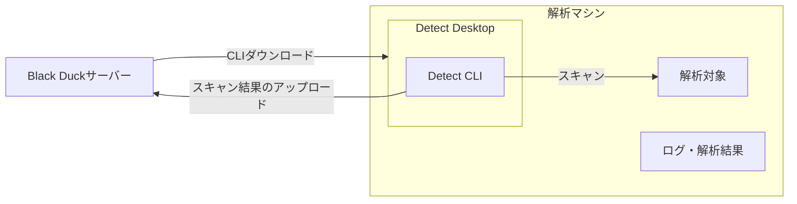
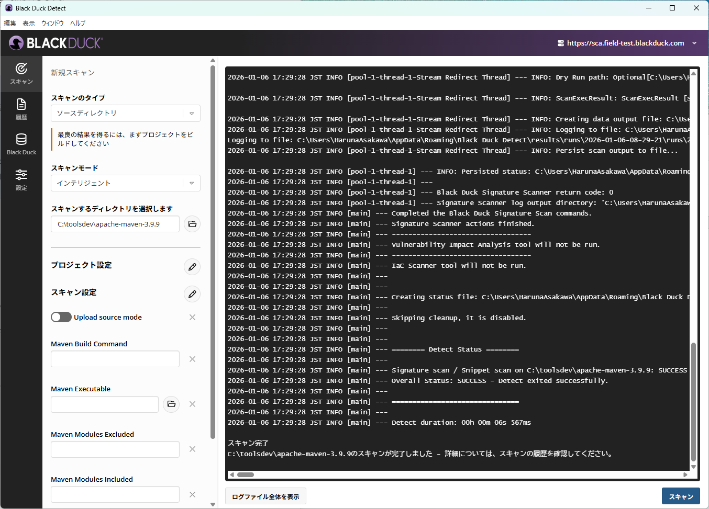
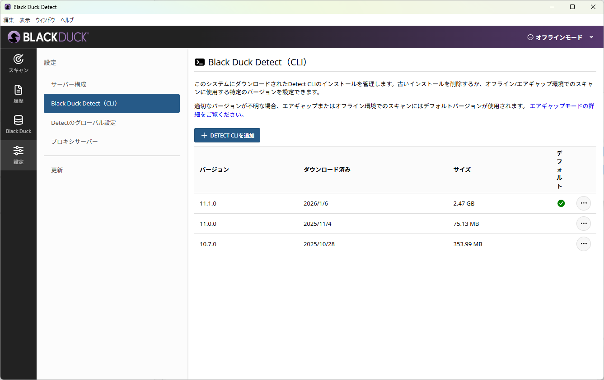
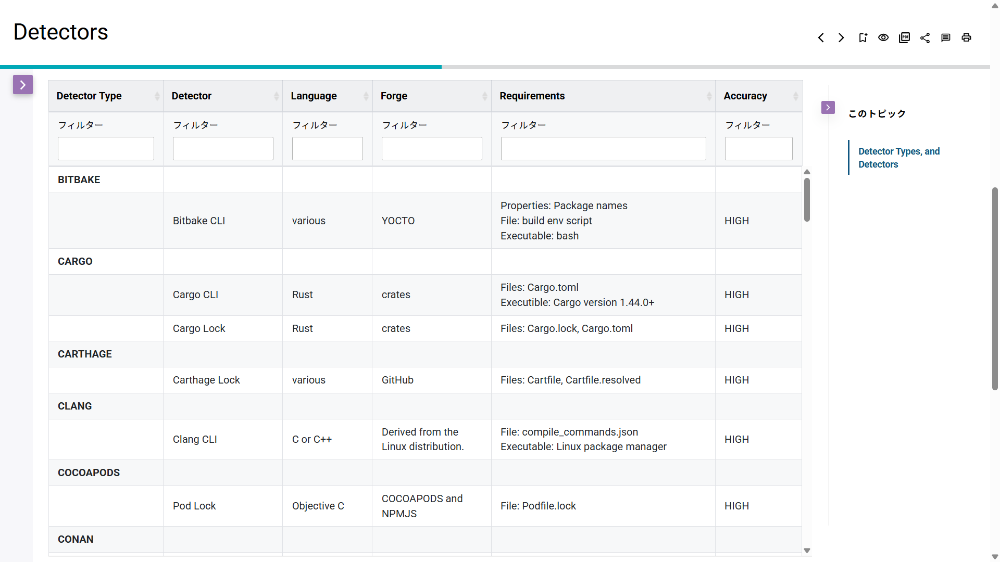
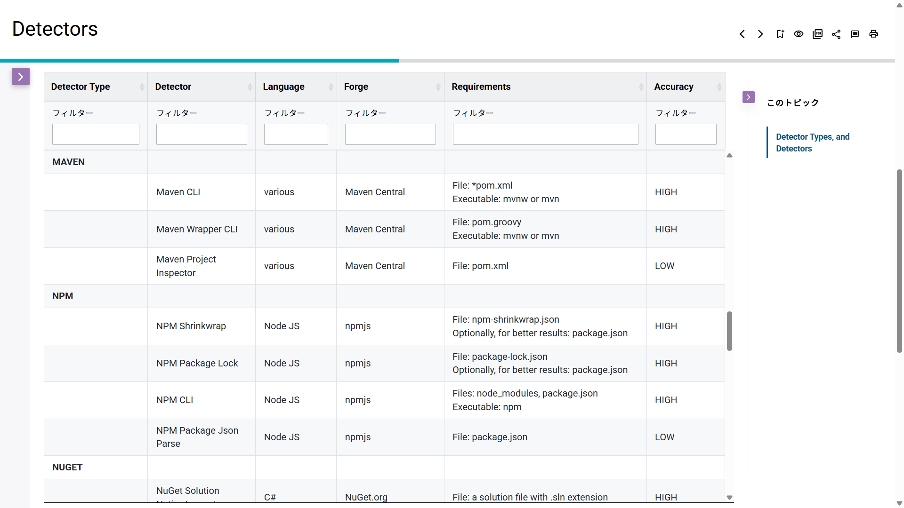
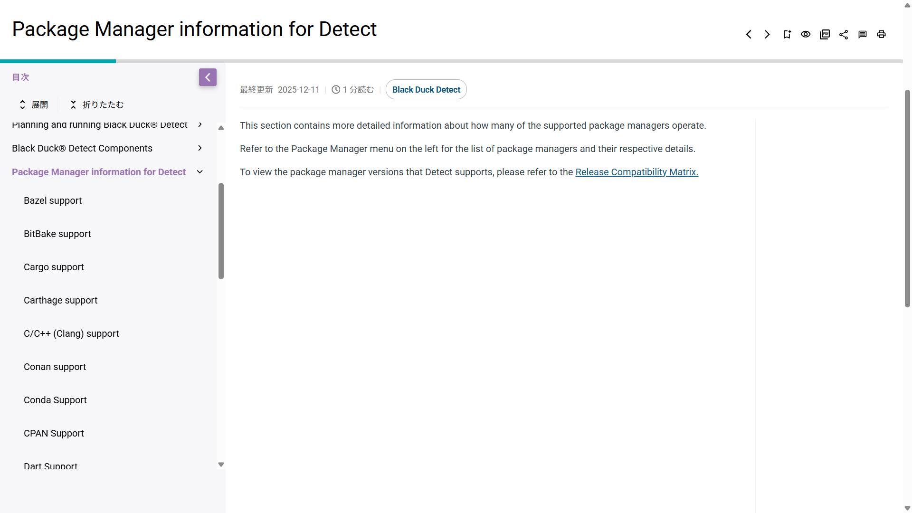

# PoVガイド実践編

## PoVの流れ

1. 開発環境のヒアリングと PoV の達成目標の確認（約1時間）
2. お客様環境のご準備
    - お客様: Black Duck のインストール／セットアップ
    - 弊社: サーバー情報およびドキュメントの共有（2〜3営業日）
    - お客様: Black Duck Detect の準備（デスクトップ版のインストール等）
3. スキャン実施
    - お客様: Black Duck Detect で対象のソースコードをスキャン
    - 弊社: スキャンのサポートを実施
    - オフラインスキャンの場合は、スキャン結果（.json、.jsonld ファイル）を ShareFile 等で受け渡します
4. 弊社で結果の確認（約1週間）
5. Black Duck サーバの Web UI を使ってお客様と結果レビューを実施（約1時間）

## 構成



## ダウンロード・インストール・初期設定

### Black Duck Hub（PoV Hosted）の初期設定

担当SEから Black Duck PoV Hosted 環境の「URL」「ログインユーザー名」「パスワード」が送付されます。
URL にアクセスしてログインを確認してください。

> [!NOTE]
> Black Duck Hub はブラウザの言語設定により、自動的に表示言語（日本語、英語など）が切り替わります。別の言語で表示する場合は、ブラウザの言語設定を切り替えてください。

### ユーザーの作成

PoV Hosted を利用する場合、ユーザー名およびパスワードは担当SEから通知されます。ユーザーの新規作成は行えません。

### プロジェクトおよびプロジェクトバージョンの作成

プロジェクトとプロジェクトバージョンは解析結果を管理する単位です。作成手順は以下の通りです。

1. Black Duck Hub の右上の「＋プロジェクトを作成」 - 「標準プロジェクト」をクリック
2. 「標準プロジェクトの作成」画面で以下を入力して「保存」をクリック
    - プロジェクトグループ：Black Duck Project Group（デフォルト）
    - プロジェクト名：解析対象の名称を推奨
    - バージョン名：解析対象のバージョン名を推奨

作成後、ホーム画面にプロジェクトが表示されます。

> [!NOTE]
> 後述する 解析作業時にBlack Duck Detect を経由して、プロジェクトおよびプロジェクトバージョンを作成することも可能です。

### Black Duck Detect のインストール

Black Duck Detect で解析対象コードをスキャンします。Detect にはデスクトップ版と CLI 版があり、ここではデスクトップ版の導入手順を説明します。

Black Duck Detect の環境要件（概要）
詳細: [Black Duck® Detect requirements and release information](https://documentation.blackduck.com/ja-JP/bundle/detect/page/unsupportedreleasenotes.html)

- Linux、macOS、または Windows
- 最低メモリ: 8GB
- Java: OpenJDK 64ビット
    - サポートバージョン: 8、11、13、14、15、16、17、21
        - Java 11 を使用する場合は 11.0.5 以降が必要
- プロジェクトがビルド可能な環境（パッケージマネージャ使用時）
- Docker（イメージをスキャンする場合）
- Detect 実行マシンから Black Duck サーバへネットワーク接続可能であること

詳細: [Getting Started with Black Duck Detect](https://documentation.blackduck.com/ja-JP/bundle/detect/page/gettingstarted/overview.html)

インストールと初期設定手順は以下の通りです。

1. Black Duck Detect のインストール
    1. Black Duck サーバにアクセスし、「＜ユーザー名＞」 - 「ツール」 よりツールをダウンロード
    2. ダウンロードしたインストーラに従って、インストール
2. アクセストークンの取得
    1. Black Duck サーバーで「＜ユーザ名＞」 - 「アクセストークン」 に移動
    2. 「＋トークンを作成」をクリック
    3. 「トークンを作成」画面で以下を入力して「作成」ボタンをクリック
        - 名前：任意の名前（Detect の環境名や解析対象名などを推奨）
        - スコープ： 読み書きアクセス
    4. トークン をコピー
3. Black Duck Detect のサーバーの追加設定
    1. Black Duck Detect の 「設定」 - 「サーバー構成」 に移動
4. 「サーバーの追加」 ボタンをクリック
    1. 「サーバーの追加」 画面で以下の必須項目を入力して「Submit」ボタンをクリック
        - Black Duck サーバー URL： Black Duck サーバーのURL
        - API トークン： 前手順で取得したアクセストークン
    2. 「サーバー構成」画面で、追加したサーバーの「バージョン」が取得できているか確認

### 固有の設定

- [プロキシ設定](#プロキシ設定)
- [オフラインスキャン](#オフラインスキャン) : Detect 環境から Black Duck サーバーにネットワークアクセスができない場合の設定および解析方法

## 解析

### 代表的な解析方法（シグネチャースキャン）

ここでは、標準の解析方法である「シグネチャースキャン」を実施する方法を説明します。

手順の途中の「プロジェクト設定」と「スキャン設定」では、スキャン画面の「鉛筆アイコン」から設定項目（プロパティ）を表示させる必要があります。鉛筆アイコンをクリックし、表示されるダイアログでキーワード検索して該当項目をチェックしてください。 #TODO-IMAGE

1. Black Duck Detect を起動
2. 画面右上のURLが、Black Duck PoV のサーバーURL であることを確認
3. 「スキャン」を選択
4. 「新規スキャン」画面で、以下を設定
    - スキャンのタイプ: ソースディレクトリ
    - スキャンモード: インテリジェント
    - スキャンするディレクトリ: 解析対象のディレクトリを指定
    - プロジェクト設定： 必要な設定項目を鉛筆アイコンから追加して設定
        - Project Name ：プロジェクト名（事前に設定したもの、もしくは新規に指定。解析対象の名称・製品や部品名などを推奨。）
        - Version Name：プロジェクトバージョン名（事前に設定したもの、もしくは新規に指定。解析対象のバージョンなどを推奨。）
5. スキャンボタンをクリック

> [!NOTE]
> スキャンモードの種類は下記の通りですが、多くの場合は「インテリジェント」のみを使用します。
>
> 詳細：[Detect Desktopでスキャン](https://documentation.blackduck.com/ja-JP/bundle/bd-hub/page/ComponentDiscovery/scanningDetectDesktop.html)
>
>- インテリジェント：通常のスキャンモード。
>- 急速：ポリシー違反のみを検出するモード。Black Duck Hubにデータを保持しません。
>- ステートレス：Limited Customer Availability (LCA)での機能となります。通常使用しません。

ログの最後に「スキャン完了」と表示されたら、完了です。



## 結果確認

### 代表的な解析方法の結果

Black DuckサーバのURLにアクセスするとログイン画面が表示されます。

担当者から案内された初期ユーザー名／パスワードを入力してログインしてください。

ダッシュボードより対象のプロジェクト - バージョンを選択すると、コンポーネントのリストとともに、各リスクが確認できます。

スキャン結果が正常にBlack Duck Hubに送信できているかは、スキャン画面より確認が出来ます。

細かく書く #TODO

## リザルトミーティング

書く #TODO

## Appendix

### プロキシ設定

GUIのプロキシ設定の説明と通信が発生する場所の説明を追記してください。 #TODO

プロキシ経由で通信する場合は Detect に以下のオプションを指定してください（環境に応じて設定してください）。

```shell
--blackduck.proxy.host
--blackduck.proxy.port
--blackduck.proxy.username
--blackduck.proxy.password
```

NTLM認証の場合は以下のオプションも適宜設定してください。

```shell
--blackduck.proxy.ntlm.domain
--blackduck.proxy.ntlm.workstation
```

### オフラインスキャン

スキャン画面の「Offline Mode」 を True に設定すると、オフラインモードで動作し、解析結果が自動で Black Duck サーバーに送信されません。Upload source mode を設定していた場合は無効となります。
解析環境から、Black Duck PoV Hosted 環境へのアクセスに問題がある場合は、オフラインモードで解析を実施します。

1. Detect GUIで「Offline Mode」を有効にしてスキャン
2. スキャン後に「ログファイル全体を表示」をクリック
3. 以下のディレクトリのファイルを取得
    - runs
        - 日付のフォルダ
            - scan
                - BlackDuckScanOutput
                    - 日付のフォルダ
                        - data
                            - 「.bdio」 ファイル

オフラインスキャン後は、解析結果をBlack Duck サーバーにアクセスできる環境にコピーして、Black Duck サーバー の「スキャン」メニューからアップロードします。

1. Black Duck SCA にログイン
2. 「スキャン」メニューをクリック
3. 「スキャン」画面の「ファイルのアップロード」 - 「BDIOスキャン」をクリック
4. BDIOファイル（.json, .bdio, bdmu）参照して、「スキャン」をクリックしてアップロード
5. スキャン画面の該当ファイルの右のメニューから「プロジェクトにマップ」をクリック
6. 「スキャンをプロジェクトバージョンにマップ」画面で、プロジェクトとプロジェクトバージョンを指定

詳細: [スキャンファイルのアップロード： Black Duck SCA](https://documentation.blackduck.com/ja-JP/bundle/bd-hub/page/ComponentScans/UploadFile.html#UploadingScanFileUsingUI)

### Air Gapモード

解析環境がインターネットに接続されていない場合、Detect CLIをダウンロードして手動で解析環境にコピーします。解析後の手順は、オフラインスキャンと同様です。
詳細：[Detect Air Gap mode](https://documentation.blackduck.com/ja-JP/bundle/detect/page/downloadingandinstalling/airgap.html)

1. Detect CLIのダウンロード
    1. [Download Locations for Black Duck® Detect & Plugins](https://documentation.blackduck.com/ja-JP/bundle/detect/page/downloadingandinstalling/downloadlocations.html) から 「The Detect binary repository (.jar and air gap zip files) for 10.0.0 and later: [Binary files](https://repo.blackduck.com/bds-integrations-release/com/blackduck/integration/detect/)」 リンクをクリック
    2. 最新バージョンのディレクトリの 「detect-<バージョン名>-air-gap.zip」 ファイルをダウンロード（このファイルが、Detect CLIです）
2. Detect CLIの追加
    1. Detect GUI の「スキャン」画面で「Offline Mode」を有効にする
    2. 「設定」 - 「Black Duck Detect（CLI）」をクリック
    3. 「Black Duck Detect（CLI）」画面で、「＋Detect CLIを追加」をクリックして、ダウンロードしたファイルを指定
3. スキャンを実施



元情報が古いと思う #TODO

```text
古い情報
4. detect.jarの配置
    1. 入手したdetect-<バージョン>.jarを任意のディレクトリに配置
5. Black Duck Detectのヘルプ表示による動作確認
    ```bash
    java -jar detect-<バージョン>.jar -h
    ```
6. スキャンCLIクライアントの配置
    1. 任意のディレクトリに入手したスキャンCLIのキット(scan.cli.zip)を解凍する
    2. 例：$HOME/blackduck/tools/Black_Duck_Scan_Installation/scan.cli-<バージョン>
    3. ※ synopsys-detect.jarとscan.cli.zipは弊社から連携いたします。
```

Black Duck Detect （CLI）：オフラインスキャンの実行例

```bash
java -jar detect-x.x.x.jar \
   --blackduck.offline.mode=true \
   --detect.project.name="プロジェクト名" \
   --detect.project.version.name="バージョン名" \
   --detect.source.path="<ソースディレクトリ>" \
   --detect.tools=SIGNATURE_SCAN \   
   --detect.blackduck.signature.scanner.local.path= \
   "$HOME/blackduck/tools/Black_Duck_Scan_Installation/scan.cli-xxxx.xx.x" \
   --detect.output.path="$HOME/blackduck/output/"
```

[JARファイルのバイナリリポジトリ](https://repo.blackduck.com/bds-integrations-release/com/blackduck/integration/detect/)

### Detect の パッケージマネージャ解析設定

Detect によるスキャンでは、お客様がお使いのパッケージマネージャーによって必要な要件や設定がある場合があります。

ここでは #TODO

#### 要件の調査方法

ドキュメント： [Detectors](https://documentation.blackduck.com/ja-JP/bundle/detect/page/components/detectors.html) の表でお使いのパッケージマネージャーを探し以下を確認「Detector Type」の欄を確認し、必要な要件がそろっているか確認します。



特に確認すべき列は以下です。

- Requirements: その方法でのパッケージの検出に必要な要件
- Accuracy: その方法で得られる結果の精度の目安

例：Mavenの場合



上記の例の場合、Mavenに対しては、Maven CLI, Maven Wrapper CLI, Maven Project Inspector の3種類のDetector をサポートしています。Maven Project Inspector では、pom.xml ファイルのみが要件となっていますが、Accuracy は LOW となります。Maven CLI は Accuracy は HIGH ですが、mvn コマンドが実行可能であることを要求します。しかし精度は上がります。

---

上記のドキュメント：Detectors では 概要を表形式で掲載していますが、詳細を確認する場合は、ドキュメント：[Package Manager information for Detect](https://documentation.blackduck.com/ja-JP/bundle/detect/page/packagemgrs/overview.html) 配下の「＜パッケージマネージャー名＞ Support」 のページを確認します。



#### オプションの設定

グローバルに設定する方法と、スキャンで設定する方法（鉛筆マークからなのでわかりにくい）がある。（他にも環境変数があるが紹介しない）

Detector の設定とそれ以外（Debug）とかのジャンルがある。

https://documentation.blackduck.com/ja-JP/bundle/detect/page/properties/basic-properties.html
https://documentation.blackduck.com/ja-JP/bundle/detect/page/properties/configuration/default.html
https://documentation.blackduck.com/ja-JP/bundle/detect/page/properties/detectors/overview.html
https://documentation.blackduck.com/ja-JP/bundle/detect/page/properties/detectors/maven.html

#### 例：MAVEN – maven の動的スキャン

Maven以外を指定したい場合にはここをご変更ください。

他のDetectorについては[こちら](https://synopsys.atlassian.net/wiki/spaces/INTDOCS/pages/631308479/Detect+Tools)をご覧ください。

1. 黄色枠のURLがサーバーURLになっていることを確認
2. スキャン設定
    1. Maven Build Command
    2. Maven Build Command :入力
3. スキャンボタンを押下、スキャン開始

設定から、”Black Duck Detect”より、detectorを選択

### CLI による解析

CLIは、Linux および Windows をサポートしています。実行には、Black Duck サーバーのアクセストークンが必要です。デスクトップ版と同様の手順で取得してください。

クイックスタートガイド ([Detect Quickstart guide](https://documentation.blackduck.com/ja-JP/bundle/detect/page/gettingstarted/quickstart.html)) では、CLIを使用した手順を紹介しているため、併せて参照してください。

以下では、オプションが殆どないCLIのコマンド例を紹介しています。このコマンドの実行によりBlack Duck Detect自体もダウンロードされ、スキャン後、直接PoV用Black Duckサーバにシグネチャ情報がアップロードされます。

Linuxの場合のコマンド例

```bash
bash <(curl -s -L https://detect.blackduck.com/detect.sh) --blackduck.url="<サーバーURL>" --blackduck.api.token="<アクセストークン>"
```

Windows（Powershell）のコマンド例

```powershell
powershell "[Net.ServicePointManager]::SecurityProtocol = 'tls12'; irm https://detect.blackduck.com/detect.ps1?$(Get-Random) | iex; detect" --blackduck.url="<サーバーURL>" --blackduck.api.token="<アクセストークン>"
```

> [!NOTE]
> 下記のページから、Bash または PowerShell スクリプトをダウンロードすることも可能です。
> [Download Locations for Black Duck® Detect & Plugins](https://documentation.blackduck.com/ja-JP/bundle/detect/page/downloadingandinstalling/downloadlocations.html)

上記のコマンドに、目的や環境に応じてオプションを追加します。
ここからは、Linux(bash) で実行する例のみを紹介します。

標準的なソースコードスキャン（シグネチャースキャン）例

```bash
bash <(curl -sL https://detect.blackduck.com/detect10.sh) \
    --blackduck.url="https://examplehub.blackducksoftware.com" \
    --blackduck.api.token="<APIトークン>" \
    --detect.project.name="<プロジェクト名>" \
    --detect.project.version.name="<バージョン名>" \
    --detect.source.path="<ソースディレクトリ>" \
    --detect.tools=SIGNATURE_SCAN
```

スニペットスキャン例

```bash
bash <(curl -sL https://detect.blackduck.com/detect10.sh) \
  --blackduck.url="https://examplehub.blackducksoftware.com" \
  --blackduck.api.token="<APIトークン>" \
  --detect.project.name="<プロジェクト名>" \
  --detect.project.version.name="<バージョン名>" \
  --detect.source.path="<ソースディレクトリ>" \
  --detect.tools=SIGNATURE_SCAN \
  --detect.blackduck.signature.scanner.snippet.matching=SNIPPET_MATCHING \
  --detect.blackduck.signature.scanner.upload.source.mode=true
```

> [!WARNING]
> `detect.blackduck.signature.scanner.upload.source.mode` はソースコードを Black Duck サーバにアップロードするオプションです。取扱いに注意してください。

CLIに渡すオプションを何にするかの調査には、一度GUIで解析し、ログから使用したオプションを参照すると便利です。


### バイナリスキャン

解析対象を単一のバイナリファイルにするときは、Black Duck Detect のスキャン設定を以下のようにしてください。

- スキャンのタイプ:  バイナリ/実行可能ファイル
- スキャンするファイルを選択します： 解析対象のバイナリファイルを指定
- プロジェクト設定
    - Project Name：任意
    - Version Name：任意

### スニペットスキャン

ライセンス違反の防止のため、OSSの断片がソースコードに混入しているかチェックしたい場合は、スニペットスキャンを実施します。スニペットスキャンを実施する場合は、Black Duck Detect のスキャン設定を以下のように設定します。

- スキャンのタイプ：ソースディレクトリ
- スキャンモード：インテリジェント
- スキャンするディレクトリを選択します：解析対象
- プロジェクト設定
    - Project Name：任意
    - Version Name：任意
- スキャン設定
    - Snippet Matching : SNIPPET_MATCHING
    - Upload source mode： True

> [!WARNING]
> 「Upload source mode」を有効にするとソースコードが Black Duck サーバへアップロードされます（弊社 SE が内容を取得することはありません）。
> 無効でも動作しますが、サーバ上でのレビューが不便になる場合があります。

### C/C++ ツール

C/C++ ツールは、C/C++ アプリケーションのSCA解析に関する以下の課題を解決するためのオプション解析機能です。
必要に応じてご利用ください。

- 依存関係を管理するための標準パッケージマネージャまたはメソッドがない。
- ビルドツールに多数の環境変数、パラメータ、およびスイッチがある。
- ビルドツールは、ビルドディレクトリの外部にあるファイルへの参照を作成して、ビルドの一部として含まれる。
- ビルドディレクトリ内にはビルドの一部ではないファイルがあり、構成表内部で誤検出が発生する原因になる。

Black Duck C/C++ スキャン拡張機能は、Build Captureと呼ばれるCoverityの機能（Coverityの購入は不要）を使用して、前述した課題を回避します。コンパイラとリンカのすべての呼び出しを監視し、コンパイルされたすべてのソースコード、インクルードされたヘッダーファイル、およびリンクされたオブジェクトファイルのパスを格納します。

Install blackduck-c-cpp

```bash
pip install blackduck-c-cpp
```

Build configuration uses .yaml files or command line arguments. Here is a sample .yaml file 。

```yaml
build_cmd: /home/theUser/ardour/waf build
build_dir: /home/theUser/ardour/build/
coverity_root: /home/theUser/coverity-analysis/
skip_build: False
verbose: True
project_name: ardour
project_version: 1
codelocation_name: ardour
bd_url: https://…
api_token: <token>
insecure: False
```

Scan C/C++ project

```shell
blackduck-c-cpp –-config <yaml file>
```

詳細リンク #TODO

### トラブルシューティング・補足

#### よくあるトラブル

このセクションにはよくあるトラブル事例を記載してください。 #TODO

参考: https://documentation.blackduck.com/ja-JP/bundle/detect/page/troubleshooting/solutions.html

#### スキャンエラーが発生した場合

エラーが発生したときは、ログをSEに送付してください。その際に、ログレベルを変更してください。

1. Black Duck Detect を起動
2. 「設定」 - 「Detect のグローバル設定に移動
3. 「logging」 カテゴリ の 「Logging Level」を「Trace」 に設定
4. 再スキャンを実施
5. 「履歴」 から 「ファイルの表示」をクリックして、ログファイルが格納されたディレクトリを表示
6. TRACE.log を 送付

参考: [Collecting Detect log information](https://documentation.blackduck.com/ja-JP/bundle/detect/page/troubleshooting/gettinginfo.html)

#### Depth

Depth に関する注意点や関連トラブルを追記してください。 #TODO

参考: https://documentation.blackduck.com/ja-JP/bundle/detect/page/runningdetect/detectorcascade.html

### JSON/JSONLD ファイルの内容について

必要に応じて本節を参照してください。JSON/JSONLD ファイル内の主な項目は以下の通りです。

1. `scannerVersion`: スキャンを行ったクライアントのバージョン
2. `signatureVersion`: Black Duck Hub が OSS マッチングに使用するシグネチャのバージョン（例: 7）
3. `ownerEntityKeyToken`: エンティティ種別（"SN" 等）、ホスト名、スキャン名の組み合わせによる識別子
4. `createdOn`: スキャン実行日時
5. `timeToScan`: スキャンに要した時間
6. `name`: スキャン名（ユーザー指定）
7. `hostname`: スキャンを行ったホスト名
8. `baseDir`: スキャン対象のトップディレクトリ
9. `scanNodeList`: スキャンされたファイル・ディレクトリ・アーカイブ情報
    - `id`: スキャナが付番した番号
    - `parentId`: 親ディレクトリやアーカイブの id
    - `type`: `FILE`、`DIRECTORY`、または `ARCHIVE`
    - `name`: ファイル名
    - `path`: ファイルパス
    - `size`: ファイルサイズ
    - `archiveUri`: アーカイブの場合の取得元 URI
    - `clientSignatures`: SHA-1 または “clean” SHA-1 によるハッシュ値
