# PoVガイド

## 目次

1. アーキテクチャー

    1.1. Black Duck Signalとのやり取り

    1.2. 解析プロセスとアーキテクチャー

2. ユースケースI｜コードをアップロードして解析する

    2.1. 解析フロー

    2.3. 実行までの流れ

    2.4. 準備

    2.5. インストール

    2.6. 実行

    2.7. 解析結果の確認

3. ユースケースII｜コーディングアシスタントと共に使う

    3.1. 解析フロー

    3.2. 解析モード

    3.3. 共通準備

    3.4.A. Visual Studio CodeのCopilotと共に使う

    3.4.B. Visual Studio CodeのClaudeと共に使う

## 1. アーキテクチャー

### 1.1. Black Duck Signalとのやり取り

<strong>使用者はコーディングアシスタント、Bridge CLIを通じてBlack Duck Signalとやり取りします。サービス内部ではLLM Gatewayを通じて各タスクの実行に最適な各種LLMにルーティングします。</strong>

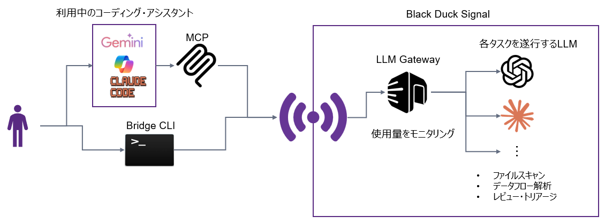

### 1.2. 解析プロセスとアーキテクチャー

<strong>CLIから個々のファイルをLLMに送信して解析します。その後必要に応じてデータフロー解析エージェントが解析を実施して偽陽性を取り除きます。最後に偽陽性をさらに減らすためにオーバーサイトエージェントが詳細にレビューします。</strong>

#### ■ 解析プロセス

1. 単一ファイル解析

    個々のファイルをLLMに送信して逐一解析

2. データフロー解析（必要に応じて）

    データフロー解析が必要そうな怪しいも問題があれば専用エージェントがデータフロー解析を実施

3. レビュー/トリアージ

    偽陽性のものを減らすように専用エージェントが最終チェックを行う

#### ■ アーキテクチャー

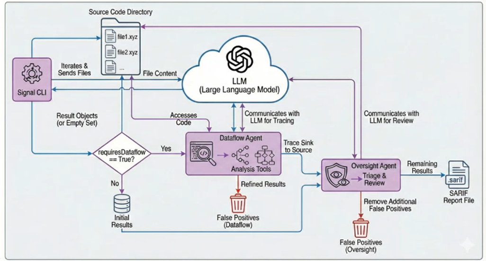

<!-- New Page -->
<div style="page-break-before:always"></div>

## 2. ユースケースI｜コードをアップロードして解析する

### 2.1. 解析フロー

<strong>Black Duck Signal CLIからBlack Duck Signalにコードをアップロードしてスキャンします。SARIFで出力された解析結果をPolaris上にインポートして結果を確認します。</strong>

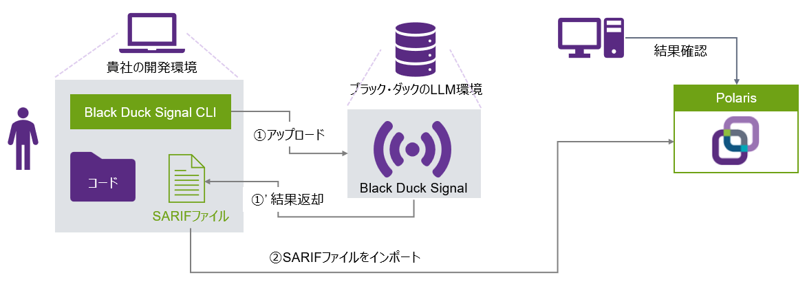

### 2.2. 実行までの流れ

<strong>通常のBridge CLIのインストールに加えて設定ファイル中のBlack Duck Signalの設定の記載が必要です</strong>

1. 準備

    - <font color="gray">LLM Gateway用のキーの作成（事前にいただいた情報をもとにブラック・ダックが発行いたします）</font>
    - <font color="gray">Polarisのアカウント設定（Black Duck Signalのバイナリでの実行と同じため割愛）</font>
    - Polarisアクセストークンの作成（Black Duck Signalのバイナリでの実行と同じため割愛）

2. インストール

    - Bridge CLI（3.12.0+）のインストール
    - Black Duck Signal CLIのディプロイ

3. 設定

    - 環境変数の設定
    - Bridge CLIの設定ファイル上で<font color="#6FA215">Black Duck Signal用の設定を記述する</font>

4. 実行

    Bridge CLIを実行する

### 2.3. 準備｜アクセストークンの作成

<strong>Polarisアクセストークンをアカウント画面から作成します</strong>

[PolarisのPoC環境](https://poc.polaris.blackduck.com/)にログインし、アカウント画面の「アクセストークン」タブからトークンを作成します

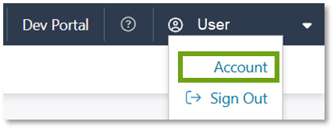
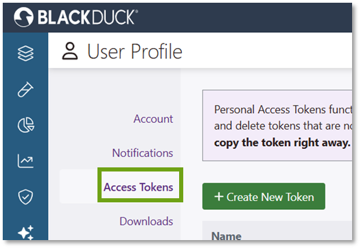

### 2.4. インストール｜Bridge CLIのインストール

<strong>3.12.0以降のBridge CLIをダウンロードして実行可能なようにPATHに登録します
</strong>

1. アカウントの「ダウンロード」タブから最新（3.12.0以降）のバージョンをダウンロードします

    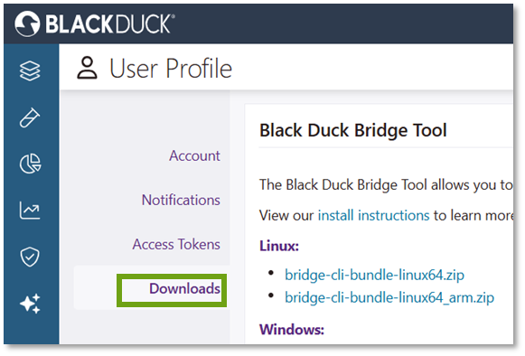

2. PATHに登録して実行可能にします

    ```shell
    # Linuxの場合。お使いのOSに応じて変更してください
    export POLARIS_BRIDGE_CLI_PATH=/your/install/bridge-cli-bundle-3.12.0-linux64
    export PATH=${PATH}:${POLARIS_BRIDGE_CLI_PATH}
    ```

### 2.5. 設定

#### 2.5.1. Black Duck Signalの設定ファイルの作成

<strong>プロジェクト内の任意の場所に設定ファイルを作成・記載します</strong>

##### ■ 設定ファイルの概要

- 目的：実行時に設定を読み込む
- 要件：Black Duck Signalのバージョン >= 0.1.3

1. 設定ファイルをプロジェクト内の任意の場所に作成

    ```shell
    [project]$ mkdir –p signal/out
    [project]$ touch signal/signal.config
    ```

2. ファイルの記載（引用符は使えません）※

    ```ini
    [SCAN]
    llm_key=YOUR_KEY
    cache_file=signal/cache.db
    summary_report_file=signal/out/scan-summary.txt
    log_file=signal/out/scan.log
    error_log_file=signal/out/signal_errors.json
    export_results=signal/results_cache.json
    exclude_paths=examples/,tests/
    oversight_embedding_enabled=True
    #oversight=False
    #dataflow=False
    exploit=True
    #extra-extensions=.hs # Haskellファイルを認識させる
    ```

> [!NOTE]
> signal --help」でオプションの一覧を見ることができます。「-」を「_」に置き換えます

#### 2.5.2. Bridge CLIの設定ファイルの記載

<strong>ブラック・ダックのLLMのURL、発行されたLLM Gatewayキー、Polarisアクセストークンを環境変数に設定します。Bridge CLIの設定ファイルにPolarisとBlack Duck Signalの項目を記載します</strong>

1. ブラック・ダックのLLMのURL、発行されたしたLLM Gatewayキー、Polarisアクセストークンを環境変数に設定する

    ```shell
    export BRIDGE_SIGNAL_LLM_URL=https://llm.core.blackduck.com
    export BRIDGE_SIGNAL_LLM_KEY="YOUR_LLM_KEY"
    export BRIDGE_POLARIS_ACCESSTOKEN="YOUR_TOKEN"
    ```

2. Bridge CLIのJSON設定ファイルを作成し、アセスメントタイプをAIに設定する。Black Duck Signalの設定ファイルとバイナリの場所を設定する

    ```diff
    {
        "data": {
            "polaris": {
                "application": {
                    "name": "YourApp"
                },
                "project": {
                    "name": "your-project"
                },
                "branch": {
                    "name": "main"
                },
                "assessment": {
    +                "types": ["AI"]
                },
    　　　　　　　　　　"serverUrl": "https://poc.polaris.blackduck.com/"
            },
    +        "signal": {
    +            "args": "--config=signal/signal.config",
    +            "execution": {
    +                "path": "path/to/signal-pyarmor-linux-x86_64"
    +            }
            }
        }
    }
    ```

### 2.6. Bridge CLIの実行

<strong>設定ファイルを指定して通常のBridge CLIを用いたPolarisでの解析実行時と同じように実行します</strong>

#### ■ Bridge CLIの実行例

```txt
[your-project]$ bridge-cli --stage polaris --input your/polaris_config.json
..(omit)..
2025-12-16 23:57:50.4535 UTC [Polaris AI-Scan] INFO: INFO:__main__:##########################################
2025-12-16 23:57:50.4543 UTC [Polaris AI-Scan] INFO: INFO:__main__:# SINGLE-FILE ANALYSIS
2025-12-16 23:57:50.4544 UTC [Polaris AI-Scan] INFO: INFO:__main__:##########################################
2025-12-16 23:57:50.4711 UTC [Polaris AI-Scan] INFO: INFO:__main__:Identified 1378 files for analysis
2025-12-16 23:57:50.4712 UTC [Polaris AI-Scan] INFO: INFO:__main__:Default analysis enabled
2025-12-16 23:57:50.8172 UTC [Polaris AI-Scan] INFO: INFO:utils:Analyzing 1 of 1378 (0%) # 解析が始まります
..(omit)..
2025-12-17 02:11:44.0058 UTC [Polaris AI-Scan] INFO: INFO:__main__:##########################################
2025-12-17 02:11:44.0058 UTC [Polaris AI-Scan] INFO: INFO:__main__:# DATAFLOW AGENT
2025-12-17 02:11:44.0058 UTC [Polaris AI-Scan] INFO: INFO:__main__:##########################################
2025-12-17 02:11:44.0058 UTC [Polaris AI-Scan] INFO: INFO:__main__: Sending xxe_vulnerability to dataflow analysis agent 
..(omit)..
2025-12-17 02:11:44.0560 UTC [Polaris AI-Scan] INFO: INFO:agents.sast:Running 283 tasks...
..(omit)..
2025-12-17 02:28:40.0906 UTC [Polaris AI-Scan] INFO: INFO:__main__:##########################################
2025-12-17 02:28:40.0907 UTC [Polaris AI-Scan] INFO: INFO:__main__:# OVERSIGHT AGENT
2025-12-17 02:28:40.0907 UTC [Polaris AI-Scan] INFO: INFO:__main__:##########################################
2025-12-17 02:28:40.0907 UTC [Polaris AI-Scan] INFO: INFO:__main__:Performing additional triage for each result...
```

SARIFファイルが .bridge/polaris_ai_scan/ フォルダに作成されます

### 2.7. 解析結果の確認

<strong>Polaris UI上のTestsタブから解析結果のSARIFファイルをインポートします。対象プロジェクトのIssueタブでツールの種類がExternal AnalysisとなっているのがBlack Duck Signalの結果です</strong>

1. PolarisのTestsタブからアプリケーションとプロジェクトを選んでSARIFファイルをインポートします

    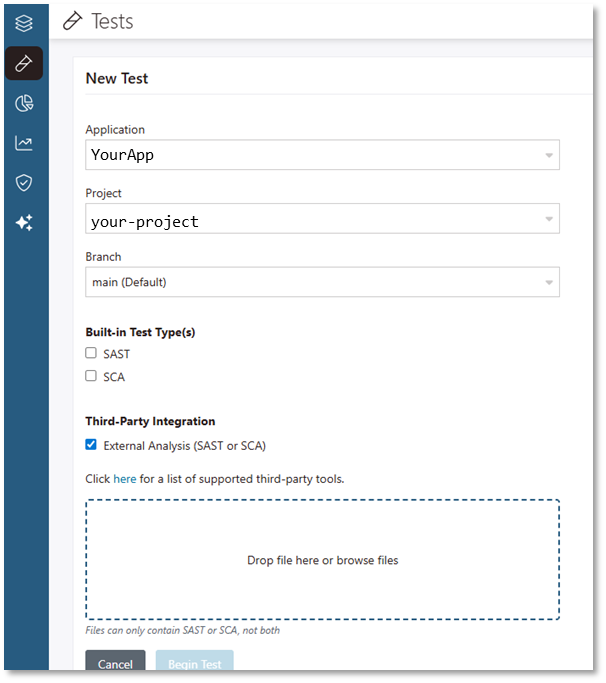

2. Polaris UI上の検知結果を確認します（SAST – External Analysis）

    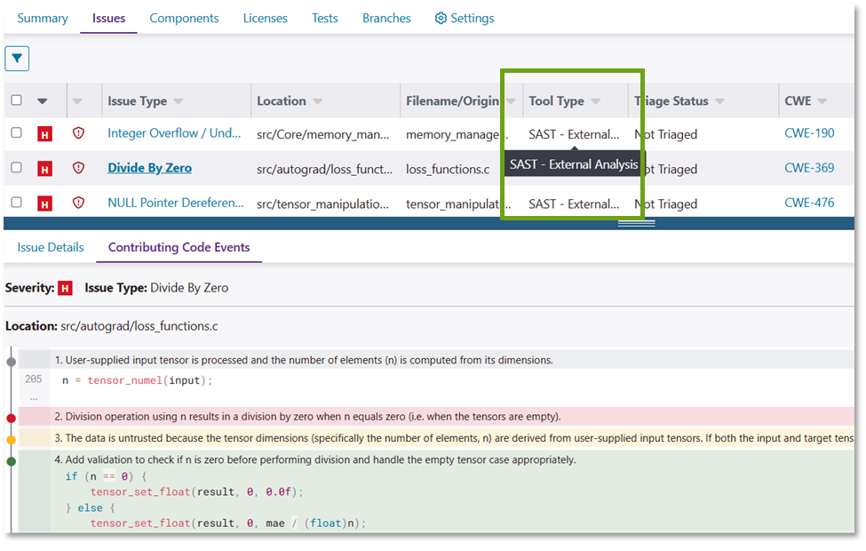

<!-- New Page -->
<div style="page-break-before:always"></div>

## 3. ユースケースII｜コーディングアシスタントと共に使う

### 3.1. 解析フロー

<strong>利用中のコーディング・アシスタントにBlack Duck MCPを登録することでコードの差分解析を活用しながら安全に開発サイクルを回すことができます</strong>

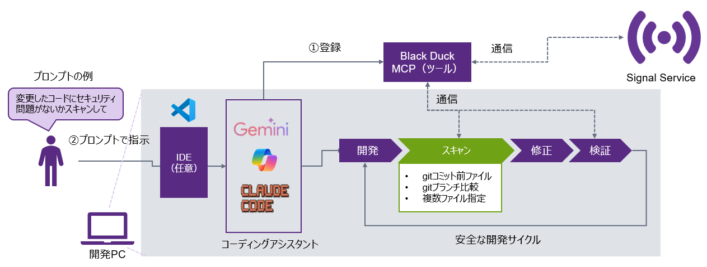

### 3.2. 解析モード

<strong>コードの変更分を解析するモードとファイルを指定して解析するモードがあります</strong>

<table style="border-collapse: collapse; width: 100%; text-align: left;">
  <tr style="background: #592A82; color: white;">
    <th style="padding: 8px; border: 1px solid #fff; width: 20%;" colspan=2>モード</th>
    <th style="padding: 8px; border: 1px solid #fff; width: 40%;">概要</th>
    <th style="padding: 8px; border: 1px solid #fff; width: 20%;">ユースケース</th>
  </tr>

  <tr style="background: #D1CDD8;">
    <td style="padding: 8px; border: 1px solid #fff;" rowspan="2">run_diff_security_scan</td>
    <td style="padding: 8px; border: 1px solid #fff;">all-uncommitted</td>
    <td style="padding: 8px; border: 1px solid #fff;">コミットされていない全てのdiffレベルの変更（staged + unstaged）を解析します</td>
    <td style="padding: 8px; border: 1px solid #fff;" rowspan="2">
      <ul>
        <li>現在のブランチの解析</li>
        <li>フィーチャーブランチの解析</li>
      </ul>
    </td>
  </tr>

  <tr style="background: #EAE8ED;">
    <td style="padding: 8px; border: 1px solid #fff;">reference-branch</td>
    <td style="padding: 8px; border: 1px solid #fff;">mainまたはmasterブランチから乖離した全てのdiffレベルの変更を解析します</td>
  </tr>

  <tr style="background: #D1CDD8;">
    <td style="padding: 8px; border: 1px solid #fff;" colspan=2>run_security_scan</td>
    <td style="padding: 8px; border: 1px solid #fff;">ファイル全体を解析します</td>
    <td style="padding: 8px; border: 1px solid #fff;">特定のファイルセットの解析</td>
  </tr>
</table>

### 3.3. 共通準備

#### 3.3.1. npmのインストール

<strong>Node.jsをインストールし、ブラック・ダックのレジストリを登録します</strong>

1. Node.js（[URL](https://nodejs.org/ja/download)）のインストラクション（右図参照）に従ってnpmをインストールする

    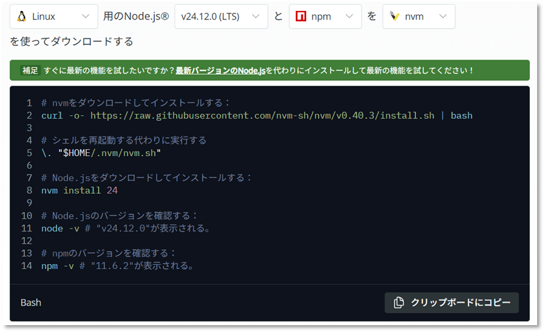

2. Node.jsをPATHに登録する※

    ```shell
    export NODE_PATH=${HOME}/.nvm/versions/node/v24.12.0/bin
    export PATH=${PATH}:${NODE_PATH}
    ```

> [!NOTE]
> ※Node.jsのバージョンは自身の環境に合わせて適宜変更してください

#### 3.3.2. 設定ファイルの作成

<strong>Black Duck Signalの実行可能ファイルと同じ場所に.scan-configというファイルを作成することで実行時に設定が読み込まれます</strong>

##### ■ 設定ファイルの概要

- 目的：実行時に共通設定を読み込む
- 要件：Black Duck Signalのバージョン >= 0.1.3
- 使い方：Black Duck Signalの実行可能ファイルと同じ場所に「.scan-config」という名前のファイルを作成（下図参照）

1. 設定ファイルをBlack Duck Signalの実行可能ファイルと同じ場所に作成

    ```shell
    # For MCP server
    $ touch ~/.blackduck/mcp/signal/.scan-config
    ```

2. ファイルの記載（除外ファイルの設定の例）

    ```ini
    [SCAN]
    oversight_embedding_enabled=True
    exclude_paths=examples/,tests/
    #include_paths=path1,path2
    #llm_key=<secret>
    #oversight=False
    #dataflow=False
    ```

### 3.4.A. Visual Studio CodeのCopilotと共に使う

#### 3.4.A.1. 実行までの流れ

<strong>Visual Studio Code上でBlack Duck MCPを登録するだけで使えます</strong>

1. 準備

    <font color="gray" weight="initial">
    LLM Gateway用のキーの作成（事前にいただいた情報をもとにブラック・ダックが発行いたします）
    </font>

2. 設定

    <font color="#6FA215" weight="initial">
    Black Duck MCPを登録（Visual Studio Code上の操作）
    </font>

3. 実行

    Copilotを使ってファイルを解析する

#### 3.4.A.2. 設定（1/2）｜ブラック・ダックのMCPサーバーの追加

<strong>コマンドパレットからMCPサーバーの追加を選択し、コマンドを入力します。スコープはGlobalに設定してVisual Studio Code上の全てのプロジェクトからお渡ししたブラック・ダックのMCPサーバーが使えるようにします</strong>

1. Ctrl+Shift+Pでコマンドパレットを開き、「MCP: Add server」を選択※1

    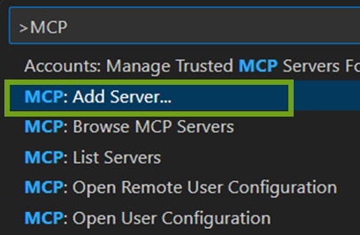

2. Command (stdio)を選択し、お渡ししたMCPサーバーのファイルを指定して「npx –y file://[file path]」と入力

    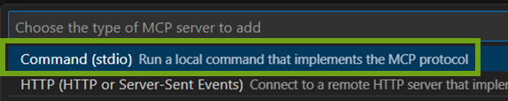
    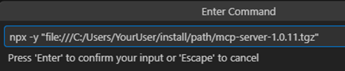

3. スコープとしてGlobalを選択※2

    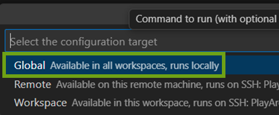

> [!NOTE]
>
> 1. Visual Studio CodeのRemote DevelopmentでVMに接続している場合は『Appendix B. リモート環境にMCPサーバーを追加する』を参照してください
> 2. Globalの場合、当該のMCPサーバーをVisual Studio Code上の全てのプロジェクトから使えます。Workspaceを選ぶと現在のWorkspaceからしか使えません

#### 3.4.A.3. 設定（1/2）｜LLM Gatewayキーの設定ファイルへの追加

<strong>MCPサーバー追加直後に開いたmcp.jsonのargs項目の後ろに環境変数として発行されたLLM Gatewayキーを記載します</strong>

1. MCPサーバー追加語に開いたmcp.jsonのargs項目の後ろにLLM Gatewayキーの設定を追加します

    ```diff
    {
      "servers": {
        "black-duck": {
          "type": "stdio",
          "command": "npx",
          "args": [
            "-y",
            "file:///C:/Users/YourUser/insall/path/mcp-server-1.1.x.tgz"
          ],
    +      "env": {
    +        "BLACKDUCK_MCP_GATEWAY_KEY": "YOUR_LLM_KEY"
    +      }
        }
      }
    }
    ```

2. ExtensionタブのMCP SERVERSに現れるMCPサーバーを設定から起動します（ログの例は下）

    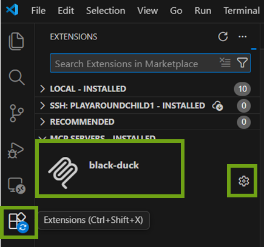

    ```txt
    2025-12-28 16:05:20.436 [info] Waiting for server to respond to `initialize` request...
    2025-12-28 16:05:21.576 [info] Discovered 1 tools
    ```

#### 3.4.A.4. 実行（1/4）｜ブラック・ダックのMCPサーバーをエージェントモードで有効化する

<strong>Visual Studio Codeの右のチャット窓をエージェントモードにし、設定から追加したブラック・ダックのMCPサーバーを有効化します</strong>

1. 右上からチャット窓を開き、エージェントモードであることを確認して設定を開きます

    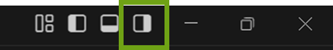

    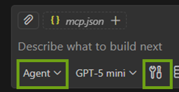

2. 追加したMCPサーバーにチェックを入れて有効化します

    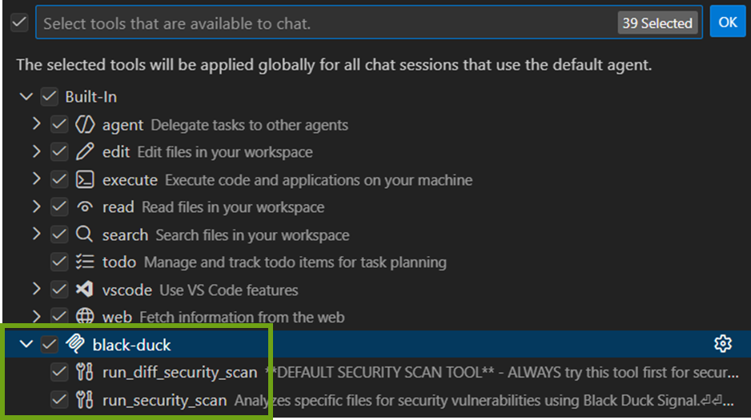

#### 3.4.A.5. 実行（2/4）｜git-diffによる差分解析

<strong>Black Duck Signalはデフォルトではgit-diffを使った差分解析を実行します。コードを変更し、変更分の解析を指示します。セキュリティス・キャン時に裏でBlack Duck Signalが使われる保証はないため、明示的に利用を指示します</strong>

1. コードを変更します

    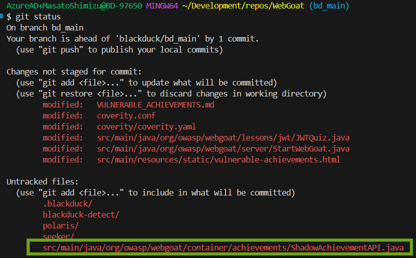

2. Black Duck Signalの使用を明記して変更分の解析を指示します
    <figure style="text-align: left; margin: 0;">
        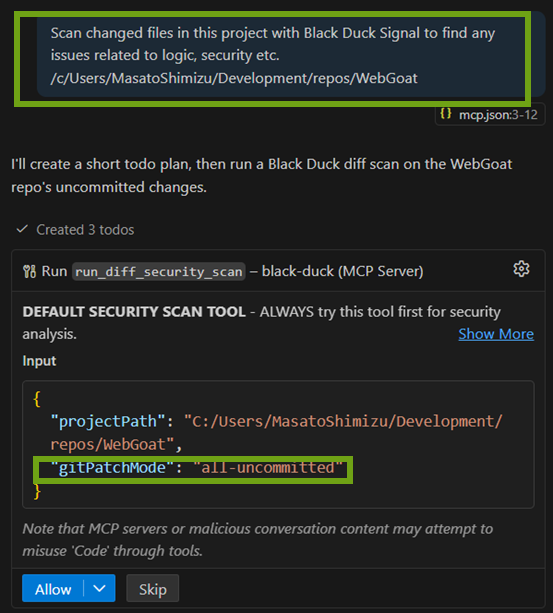
        <figcaption style="color:initial; font-weight:initial">コミットしてないコードに対して解析が行われる（下段）</figcaption>
    </figure>

#### 3.4.A.6. 実行（3/4）｜ブランチ参照による差分解析

<strong>Black Duck Signalはデフォルトではgit-diffを使った差分解析を実行します。コードを変更し、変更分の解析を指示します。セキュリティス・キャン時に裏でBlack Duck Signalが使われる保証はないため、明示的に利用を指示します</strong>

1. コードを変更します

    <figure style="text-align: left; margin: 0;">
        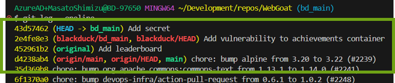
        <figcaption style="color:initial; font-weight:initial;">mainブランチからの変更分（下段）</figcaption>
    </figure>

2. Black Duck Signalの使用を明記して変更分の解析を指示します

    <figure style="text-align: left; margin: 0;">
        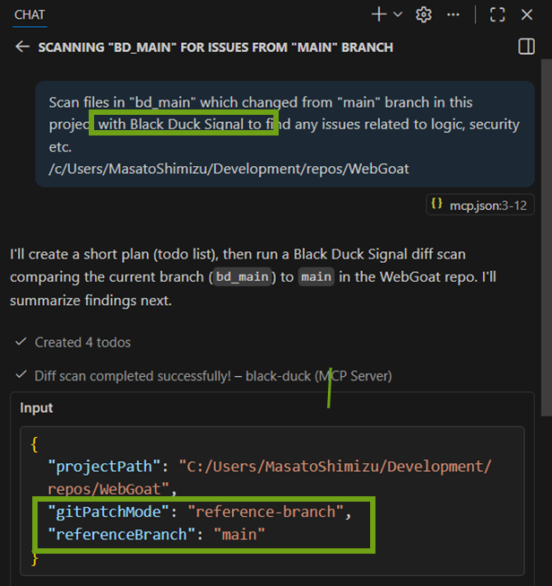
        <figcaption style="color:initial; font-weight:initial;">指定したブランチが参照先として使われている（下段）</figcaption>
    </figure>

#### 3.4.A.7. 実行（4/4）｜複数ファイルの解析

<strong>Black Duck Signalは複数のファイルを指定して解析できます。全体の解析を行う際はフォルダ内のファイルを全て選択するようにプロンプトで指示します</strong>

##### ■ 特定のファイルを指定して解析を指示

<figure style="text-align: left; margin: 0;">
    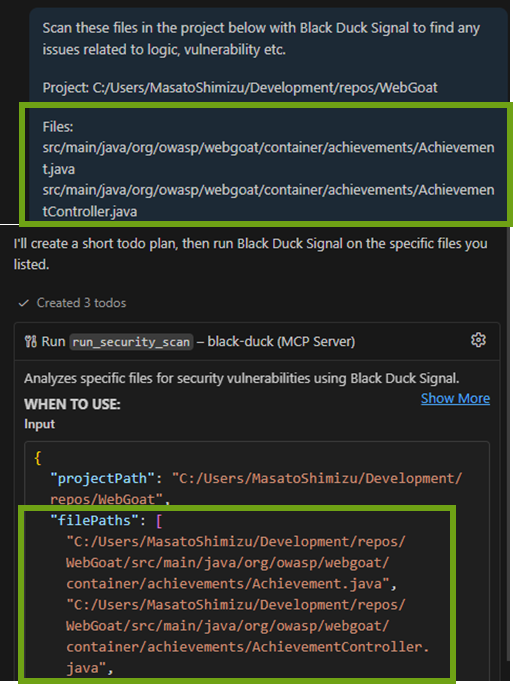
    <figcaption style="color:initial; font-weight:initial;">特定のファイル群を指定（上段）、ファイル解析が行われている（下段）</figcaption>
</figure>

##### ■ 特定のフォルダ内の全てのファイルを解析するように指示

<figure style="text-align: left; margin: 0;">
    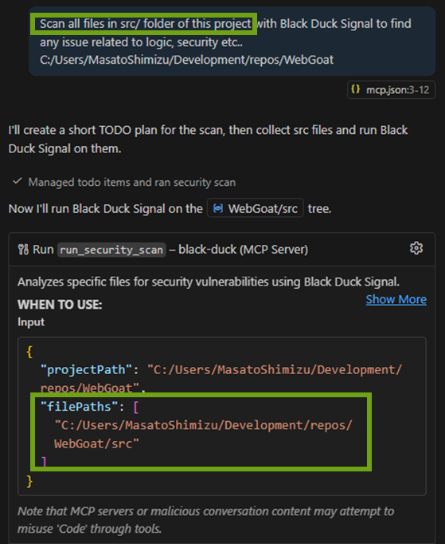
    <figcaption style="color:initial; font-weight:initial;">フォルダを指定（上段）、ファイル解析として扱われる（下段）</figcaption>
</figure>

### 3.4.B. Visual Studio CodeのClaudeと共に使う

#### 3.4.B.1. 実行までの流れ

<strong>Claude CodeからMCPサーバーを使用するにはMCPサーバーのローカルインストールが必要です。Claude CodeのVisual Studio Codeのプラグイン側の設定も必要になります</strong>

1. 準備

    - <font color="gray">LLM Gateway用のキーの作成（事前にいただいた情報をもとにブラック・ダックが発行いたします）</span>
    - <font color="gray">Black Duck MCPのローカルインストール（共通準備で完了済）</span>
    - Claude Codeのインストール
    - IDEにClaude Codeプラグインをインストールする

2. 設定

    - <font color="#6FA215">ClaudeにBlack Duck MCPを登録（CLI）</font>
    - Claude Codeの実行用の環境変数の設定
    - <font color="#6FA215">Visual Studio Codeプラグインの設定</font>

3. 実行

    Claude Codeを使ってファイルを解析する

#### 3.4.B.2. 準備｜Claude CodeおよびIDEプラグインのインストール

<strong>Claudeのインストラクションに従ってClaude Codeをインストールします。Claude CodeのIDEプラグインもインストールし、ログインプロンプトをオフにします</strong>

1. Claudeの[インストラクション](https://code.claude.com/docs/ja/setup)に従って使ってClaude Codeをインストール（以下はLinuxの例）

    ```shell
    curl -fsSL https://claude.ai/install.sh | bash
    ```

2. IDE（ここではVisual Studio Code）プラグインをインストールします

    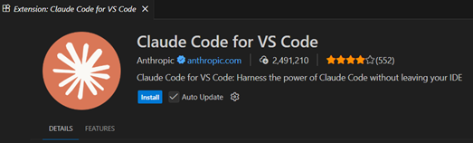

3. 設定からClaudeのログインプロンプトをオフにします

    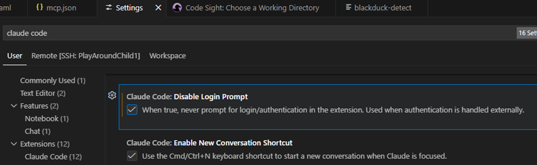

#### 3.4.B.3. 設定（1/2）｜MCPサーバーの登録

<strong>準備段階で作成したLLM Gatewayキーとブラック・ダックのLLMのURLをClaude Codeの環境変数として設定し、ClaudeのMCPに弊社からお渡ししたBlack Duck MCPサーバーを登録します</strong>

1. 作成したLLM Gatewayキーを使い、Claudeにお渡ししたBlack Duck MCPサーバーのファイルを登録します※

    ```shell
    $ claude mcp add --transport stdio black-duck --scope user --env BLACKDUCK_MCP_GATEWAY_KEY="YOUR_LLM_KEY" -- npx –y "file://path/to/mcp-server-1.1.x.tgz"

    Added stdio MCP server black-duck with command: mcp-server to user config
    File modified: /home/your-user/.claude.json
    ```

2. 接続できているか確認します

    ```shell
    $ claude mcp list
    Checking MCP server health...

    black-duck: mcp-server - ✓ Connected
    ```

> [!NOTE]
>
> - スコープはuserになっており、単一ユーザーでどのプロジェクトでも使える設定です
> - Windowsでは「"file:///C:/Users/YourUser/path/mcp-server-1.0.11.tgz"」のようになります

#### 3.4.B.4. 設定（2/2）｜Visual Studio Codeプラグインの設定

<strong>Claude CodeのVisual Studio Codeプラグインのユーザースコープの設定ファイルにブラック・ダックのLLMゲートウェイを使わせる環境変数、ログインプロンプトをオフにするオプションを追加し、モデルもclaude-sonnet-4を指定します</strong>

1. コマンドパレット（Ctrl + Shift + P）からユーザーのsetting.jsonを開きます※

    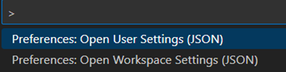

2. ブラック・ダックのLLMゲートウェイを使うための環境変数、ログインプロンプトをオフにするオプション、claude-sonnet-4を指定するオプションを追加します

    ```diff
    +   "claudeCode.environmentVariables": [
    +        {
    +            "name": "ANTHROPIC_AUTH_TOKEN",
    +            "value": "YOUR_LLM_KEY"
    +        },
    +        {
    +            "name": "ANTHROPIC_BASE_URL",
    +            "value": "https://llm.core.blackduck.com"
    +        }
    +    ],
        "chat.viewSessions.orientation": "stacked",
    +    "claudeCode.disableLoginPrompt": true,
    +    "claudeCode.selectedModel": "claude-sonnet-4",
    ```

> [!NOTE]
> ※Workspaceのsetting.jsonにClaudeのオプションを記載しない前提

#### 3.4.B.5. 実行（1/2）｜指示の失敗例

<strong>明示的にBlack Duck Signalを使うよう指示しないと使われないことがあります</strong>

1. Claudeアイコンからプラグインを起動し、変更したファイルの解析を指示※

    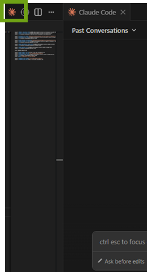
    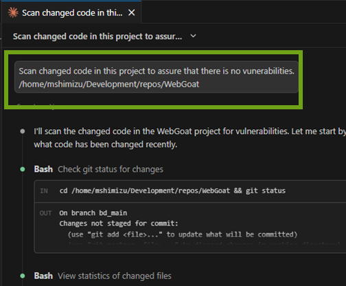

2. 結果が表示されます

    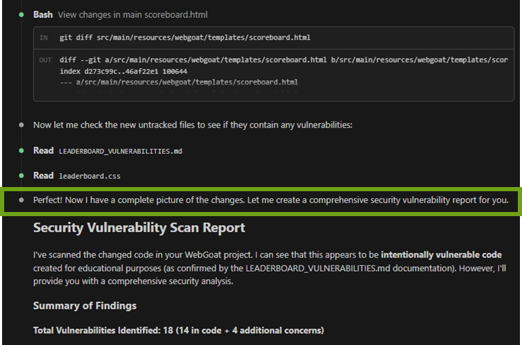

> [!NOTE]
> WindowsにおいてはファイルパスはWindowsのネイティブ書式しかサポートされません（GitBash書式不可）

#### 3.4.B.6. 実行（2/2）｜指示の成功例

<strong>Claude Codeから変更したファイルの解析を依頼します。明示的にBlack Duck Signalの使用を指示します</strong>

1. Black Duck Signalの利用を明記してセキュリティ・スキャンを指示※

    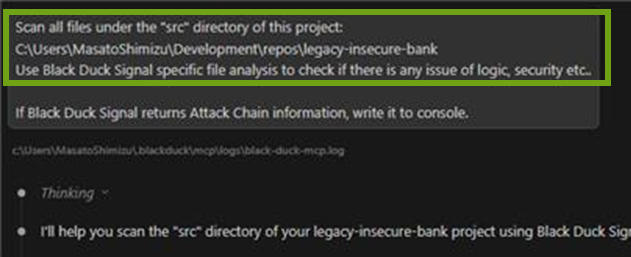

    <figure style="text-align: left; margin: 0;">
        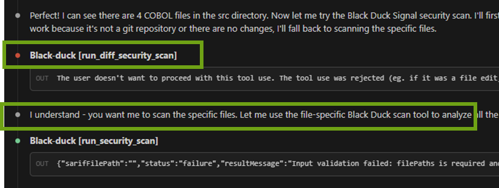
        <figcaption style="color:initial; font-weight:initial;">デフォルトのgit-diffスキャンでBlack Duck Signalが使われている（上段）、拒否して特定のファイルを解析するよう指示できる（下段）</figcaption>
    </figure>

2. 結果が表示されます

    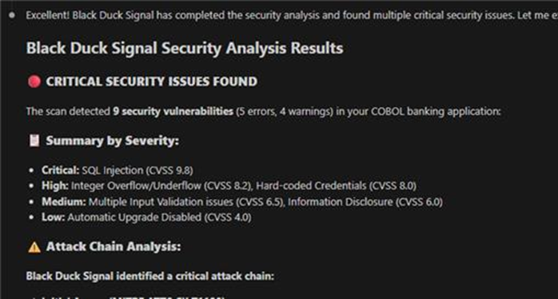

<!-- New Page -->
<div style="page-break-before:always"></div>

## Appendix. リモート環境にMCPサーバーを追加する

<strong>コマンドパレットからリモート用のMCPの設定ファイルを開き、それを編集してMCPサーバーを追加します。追加されたMCPサーバーはExtensionsタブを開くとリモートアイコン付きで表示されます</strong>

1. 「Open Remote User Configuration」を選択し、リモートの設定ファイルを開く

    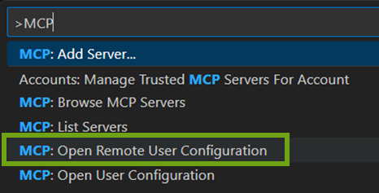
    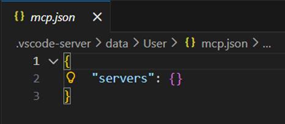

2. 開いた設定ファイルを編集して環境変数と共にブラック・ダックのMCPサーバーを追加する

    ```json
    {
      "servers": {
        "black-duck": {
          "type": "stdio",
          "command": "npx",
          "args": [
            "-y",
            "file://path/to/mcp-server-1.1.x.tgz"
          ],
          "env": {
            "BLACKDUCK_MCP_GATEWAY_KEY": "YOUR_LLM_KEY"
          }
        }
      }
    }
    ```

3. ExtensionタブのMCP SERVERSに現れるMCPサーバーを起動します

    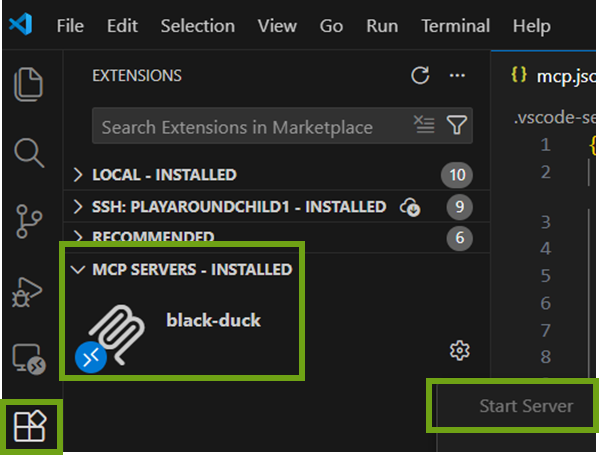
