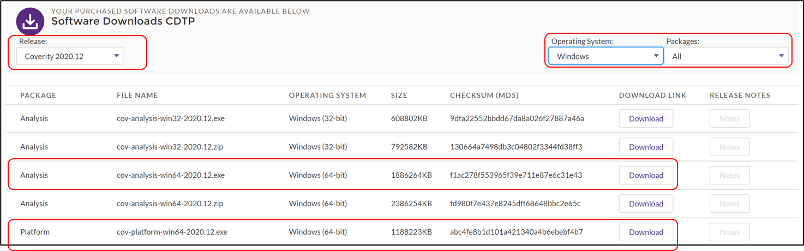
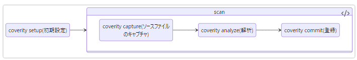
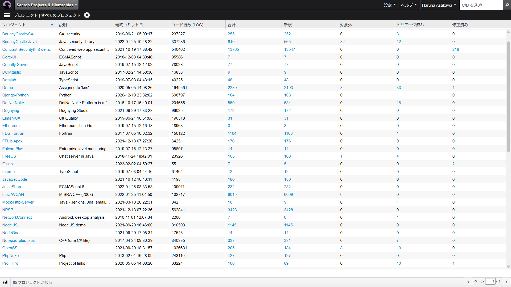
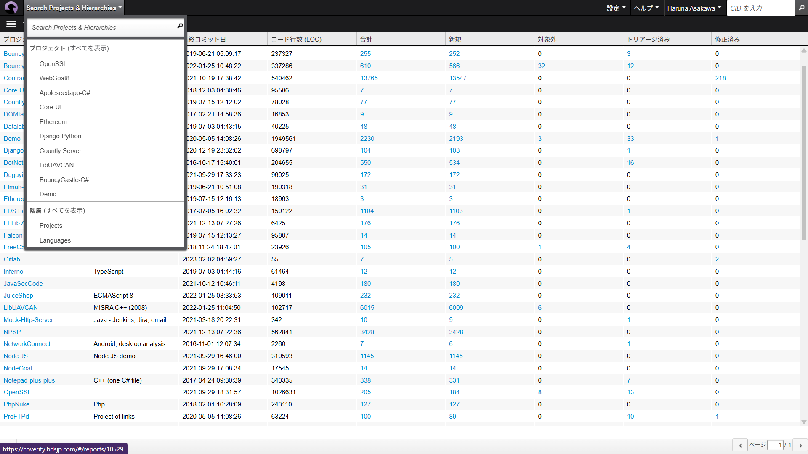
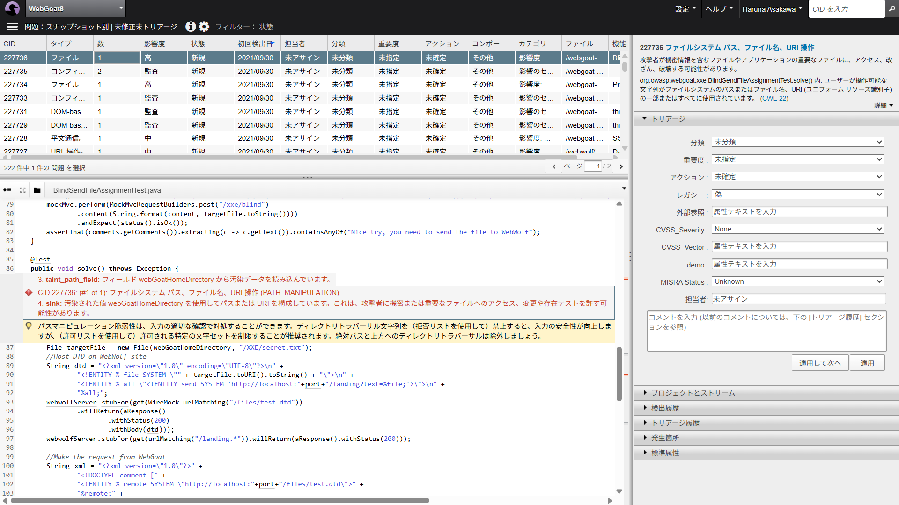
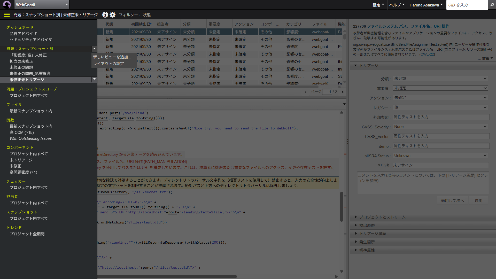
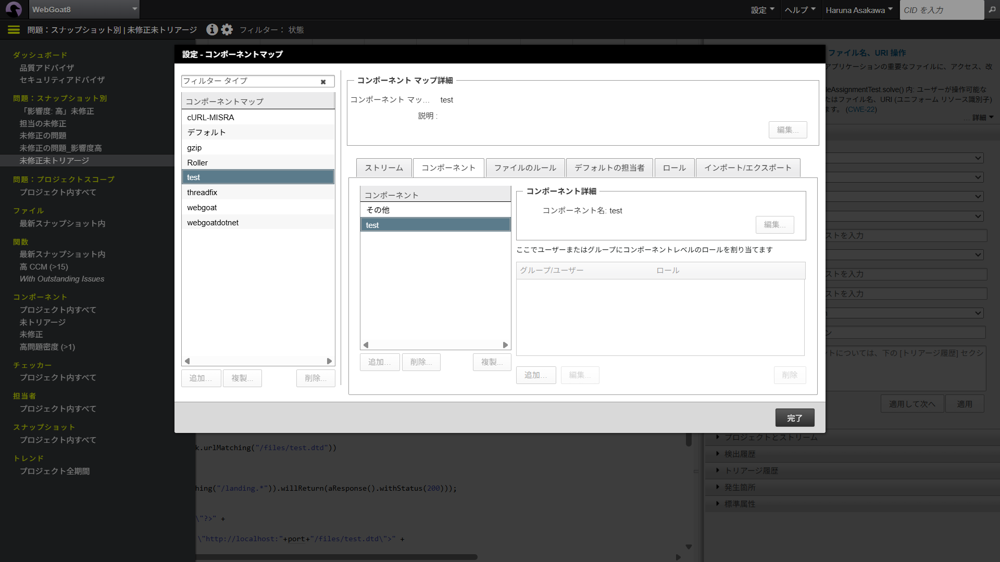

# PoVガイド実践編

## PoVの流れ

- ヒアリング
    - PoVの目的・目標と解析対象（言語、規模、ビルドコマンド等）を確認します。
    - ヒアリング結果をもとに実施可否を判断します。
- 発行・準備
    - お客様は解析用のビルド環境と Coverity をインストールする環境を準備します。
    - BDSがPoV用の1か月ライセンスを発行します。
- 解析・評価
    - お客様側で Coverity のインストール、解析、コミットを実施します（必要に応じてBDSがサポート）。
- 結果報告
    - 結果報告会（最大1.5時間程度）を行い、PoVの目的達成を確認します。
    - 開発者や購買決定者の参加を推奨します。

## ダウンロード

### Community サイト

Coverity のライセンスおよびインストーラは Community サイトから入手します。

トライアルライセンスが発行されると、Communityサイトのアカウントに関するメールと、トライアルライセンスの発行をお知らせするメール（英語）がトライアル担当者に配信されます。

ライセンス発行のメールは届いているが、アカウントのメールが届いていない場合は、  下記のログイン先で「Forgot Password」をクリックして、パスワードのリセットとアカウントの設定をお願いします。

- [https://community.blackduck.com/s/login/](https://community.blackduck.com/s/login/)

### ライセンスのダウンロード

Community サイトでPoV用ライセンスをダウンロードします。

> [!NOTE]
> 製品版では、Coverity Analysis 用と Coverity Platform 用の2種類のライセンスのダウンロードが必要です。PoV用のライセンスは、Analysis と Platform 兼用となっています。
> ライセンス名に 「SAVE」という文字列が含まれているのが Analysis 用、「Platform」 という文字列が含まれているものが Platform 用となります。

1. Communityサイトにログイン
2. 「LICENSES & DOWNLOADS」 - 「Licenses」 を選択
3. ライセンス一覧画面にあるライセンスをクリック
4. 「License Detail」画面の「Download」ボタンをクリック
5. ダウンロードしたZIPファイルを任意の場所に展開

展開先にある `license.dat` がライセンスファイルです。

> [!NOTE]
> ライセンスファイルやインストーラが表示されない場合はアクセス権の問題が考えられます。担当 SE にお問い合わせください。

### ツールのダウンロード

Community サイトから Coverity Analysis と Coverity Platform のインストーラをダウンロードします。

1. Community サイトにログイン
2. 「LICENSES & DOWNLOADS」-「Downloads」を選択
3. 必要に応じて「Product Group」と「Release Version」を選択
4. 「Operating System」と「Packages」を選び、対象マシン向けのインストーラをダウンロード

Download 画面例（Windows 64bit）



## インストール

### Coverity Platform のインストール

ダウンロードしたインストーラーを実行し、画面の指示に従ってインストールします。主な注意点は以下のとおりです。

> [!IMPORTANT]
>
> - Windows では管理者権限で実行してください。
> - Linux では `cov-platform-linux64-202x.xx.sh` を一般ユーザーで実行してください（root だとうまくいかない場合があります）。

1. インストーラーを実行
   - Windows: `cov-platform-win64-202x.xx.exe`
   - Linux: `cov-platform-linux64-202x.xx.sh`
2. インストールウィザードに沿って設定
   - Region Selection: Japan
   - License Agreement: EULA を確認して同意
   - Installer Type: Fresh Install
   - インストール先を指定
   - ライセンスファイルとしてダウンロードした `license.dat` を指定
   - Database: 同梱の PostgreSQL を使用（推奨）
   - Performance Tuning: Production
   - admin ユーザーのパスワードを設定
   - Windows サービスとして実行するか設定可能
   - ホスト名・ポートは環境に合わせて設定（デフォルト推奨）
3. 完了画面に表示されるURLにアクセスし、Coverity Connect にログインして動作を確認
   - 例：`http://localhost:8080/`
   - ユーザー名: `admin`、パスワード: インストールで設定した値
4. 必要に応じて「Admin User」->「Preference」で表示言語を変更

> [!NOTE]
> Coverity Connect をホストしている PC が Windows の場合、Windows ファイアウォールなどの設定が必要になることがあります。

### Coverity Analysis のインストール

ダウンロードした Coverity Analysis インストーラを実行し、ビルドを行うマシンにインストールしてください。

> [!NOTE]
> tar.gz（Linux）や Zip（Windows）のインストーラは任意のディレクトリに展開し、`license.dat` を `<展開先>/bin` にコピーしてください。

1. ダウンロードしたCoverity Analysis インストーラを実行（管理者での実行は不要）
    - Windows 64bit 用： ```cov-analysis-win64-202x.xx.exe```
    - Linux 64bit 用： ```cov-analysis-linux64-202x.xx.sh```
    - Linux 32bit 用： ```cov-analysis-linux-202x.xx.sh```
2. インストールウィザードに従ってツールを展開
    - ライセンスの指定画面では、```license.dat``` ファイルを指定

> [!NOTE] 注意事項
>
> - インストールウィザード中のライセンスの指定画面ではポータルサイトからダウンロードした ```license.dat``` を指定してください。
> - インストールウィザード中の選択によっては、インストール後に「Point and Scan」というアプリケーションが立ち上がります。本手順の中では使用しないため、アプリケーションを閉じて構いません。

## 初期設定

### ユーザー作成

Coverity Connect にログインする一般ユーザーを作成します。複数名で評価する場合は必要人数分を作成してください。

1. admin ユーザーで Coverity Connect にログイン
2. 右上メニューの「設定」-「ユーザーおよびグループ」を選択
3. 左下の「追加」をクリック
4. 必要情報を入力して「作成」をクリック
    - ユーザー名、パスワードを設定
    - ロケール：日本語 を指定

### プロジェクトとストリーム作成

Coverity Connect に解析結果をコミットするため、あらかじめプロジェクトとストリームを作成してください。

1. admin ユーザーで Coverity Connect にログイン
2. 「設定」-「プロジェクトとストリーム」を選択
3. 「+プロジェクト」をクリックしてプロジェクトを作成
4. 作成したプロジェクトを選択して「＋ストリーム」をクリックしストリームを作成

> [!WARNING]
> ストリーム名にマルチバイト文字やスペースを含めないでください

以降の手順ではストリーム名を参照します。

## 解析

Coverity Analysis をインストールしたマシン上で、解析対象のコードベースのビルドと解析を行います。
ここからはコマンドラインで作業を進めます。

詳細： [Using the Coverity CLI](https://documentation.blackduck.com/bundle/coverity-docs/page/cli/topics/using_the_coverity_cli.html)

### 全体の流れ

Coverity Analysis は、ツールのインストール先の bin ディレクトリに、各種コマンドが存在します。
ここでは、その中の ```coverity``` コマンド（Coverity CLI）を用いる解析を説明します。

cuda / Fortran / Scala は Coverity CLI でサポートしていません。

下記が、Coverity CLIによる解析の流れです。```coverity setup``` コマンドで初期設定を行い、```coverity scan``` で解析を行います。```coverity scan``` は3つのフェーズに分けて実行することが可能です。
初回実行時は正しく解析が実行できているか確認のため、一括で解析作業を実施する ```coverity scan``` ではなく、以下のコマンドを順次実行、結果の確認を行ってください。



各コマンドの共通オプションとして、```--dir``` オプションによる中間ディレクトリの指定があります。中間ディレクトリは Coverity 解析作業中に使用される作業ディレクトリであり、一連の解析作業で同じディレクトリを指定する必要があります。

### 1. coverity.yaml の生成

解析対象のソースコードのルートディレクトリで、```coverity setup``` コマンドを実行し、解析に必要な設定ファイル（ ```coverity.yaml```）を作成します。
coverity.yaml の細かい編集方法は、Appendix の [yamlファイルの編集](#yamlファイルの編集) で説明します。

コマンド

```bash
coverity setup
```

```coverity setup``` コマンド実行中に、対話形式で下記の情報を入力してください。

- Coverity Connect URL
- 登録先ストリーム (存在しないストリームの場合は新規に作成)
- Coverity Connect ユーザー名 / パスワード
    - 自動的に ```ak-<ホスト名>-<ポート番号>``` で認証キーを生成します
    - 認証キーの場所
        - Windows : ```%APPDATA%\Coverity\authkeys```
        - Linux : ```$HOME/.coverity```

### 2. coverity capture

解析対象のソースコードのルートディレクトリに ```coverity.yaml``` ファイルがあることを確認してください。
そのディレクトリで、```coverity capture``` を実行してください

```bash
coverity capture
```

処理が完了すると下記のようにソースファイルキャプチャー処理結果が表示されます

```bash
Capture summary:
    SUCCESS: 1551
    INCOMPLETE: 0
    FAILED: 0
    IGNORED: 527
    FILES CAPTURED: 1551
    LINES OF CODE: 431121
```

- SUCCESS : キャプチャーに成功し、解析対象となったソースファイル数
- INCOMPLETE : 部分的にキャプチャー処理に失敗したソースファイル数
- FAILED : キャプチャー処理に失敗したファイル数
- IGNORED : サポートしていない言語で記述されたソースファイル数

また、コマンドを実行したディレクトリの配下に、自動的に ```idir``` ディレクトリが作成され、中に解析に必要な中間データやログファイルが保存されます。このディレクトリを 「**中間ディレクトリ**」 と呼び、以後の解析でも使用します。

### 3. coverity analyze

```coverity analyze``` コマンドを実行し解析を行います。
引き続き、解析対象のソースコードのルートディレクトリ、coverity.yaml を配置しているディレクトリで実行してください。

コマンド

```bash
coverity analyze
```

解析結果サマリー例

```bash
Analysis summary report:
------------------------
Files analyzed                 : 1286 Total
    HTML                       : 17
    Java                       : 794
    JavaScript                 : 5
    Text                       : 470
Total LoC input to cov-analyze : 294554
Functions analyzed             : 46871
Paths analyzed                 : 2078041
Time taken by analysis         : 00:12:40
Defect occurrences found       : 187 Total
                                   2 CHECKED_RETURN
                                   1 COPY_PASTE_ERROR
                                   1 DC.DANGEROUS
                                   3 DEADCODE
                                  18 FORWARD_NULL
                                   9 GUARDED_BY_VIOLATION
                                   2 HARDCODED_CREDENTIALS
<省略>
```

解析処理が完了すると idir/output/summary.txt が作成されます。このファイルを担当SEに送付してください。

### 4. coverity commit

検出された不具合を閲覧するためには、解析結果をCoverity Connect のデータベースに登録する必要があります。この作業をコミットと呼びます。
```coverity commit``` コマンドを実行し解析結果を Coverity Connect へ登録します。

コマンド

```bash
coverity commit
```

> [!WARNING]
> PoVに限り、ここで「コミットパスワード」の入力が必要となります。入力方法および入力内容については、担当SEの指示に従ってください。

コミットが完了すると、検出された不具合を Coverity Connect で閲覧することができます。

## 結果確認

### プロジェクトへの移動

Coverity Connect にログインすると、解析結果が表示可能なプロジェクトが一覧で表示されます。
解析結果を表示したいプロジェクトをクリックすると、解析結果表示画面に遷移します。



解析結果表示画面からプロジェクトの一覧に戻るには、「プロジェクトおよび階層の検索」-「プロジェクト (すべてを表示)」 の「すべてを表示」の部分をクリックしてください。



### 不具合ビュー

下記が、Coverity Connect の問題を表示するメインのビューです。
左上の表の中から1件の問題をクリックすると、左下のエリアにソースコードと問題の内容を表示します。



### トリアージ

不具合ビューの右のエリアでは、検出された不具合に対して、レビュー済みか、担当者等の設定を行うことが可能です。これをトリアージと言います。

トリアージの例：

- 確認した問題については、「分類」を「未選別」以外に変更
    - まだ見ていない問題は「未選別」、それ以外はすでに見たものと判断できる
- 修正する場合は、「担当者」を設定する

この項目は、「コンフィギュレーション」-「属性」 の設定から独自の項目を追加可能です。

### ビューによるフィルタ



左上の表に表示する内容は、「ビュー」と「フィルタ」を設定することで、様々な条件で表示する内容を切り替えることができます。

ビューの作成方法

1. 「問題: スナップショット別」のマウスホバーで表示される、「▼」をクリック
2. 「新しいビューを追加」 で新規ビューを作成（この時点では、フィルタ条件が設定されていません）
3. 作成したフィルタのマウスホバーで表示される、「▼」をクリック
4. 「設定を編集」-「フィルタ」タブで表示条件を変更

ビューは、Coverity Connectのログインユーザーごとに保存されます。他のユーザーまたはグループとの共有も可能です。

## リザルトミーティング

リザルトミーティングでは、お客様の当初のクライテリアが達成されたかを確認します。
お客様はリザルトミーティング中に、Coverity Connect の画面を画面共有できるようにご準備ください。

## オプション機能の紹介

### コーディングルールの解析

通常の解析に加えて、各コマンドでオプションの設定が必要になります。
別ストリームを作成してのコミットを推奨します。

cov-build：  --emit-complementary-info オプションを追加

```bash
cov-build --dir idir --emit-complementary-info make
```

cov-analyze:  --coding-standard-config <設定ファイル> オプションを追加

```bash
cov-analyze --dir idir -–coding-standard-config certc-all.config
```

```certc-all.config``` ファイルはコーディングルールの解析をする際の設定ファイルです。＜Coverity Analysisインストール先＞config/coding-standards/cert-c フォルダからコピーして使用してください。

同フォルダには、コーディングルールの優先度に応じたサンプルファイルが用意されています。

一部ルールを解析しないようにしたいなど、ルールのカスタムをしたい場合は、  
```cert-c-all-deviations.config```（全部のルールを無視する設定）を参考にして、「無視する」ルールをファイルに追加してください。

### コンポーネントマップ

問題の発生箇所（ファイルパス）に応じて、検出結果を分類する機能です。
ライブラリで検出している問題を除外したり、ディレクトリごとで機能や担当者が分かれている場合に、トリアージが便利になります。

コンポーネント作成方法

1. Coverity Connect にログイン
2. 「設定」 - 「コンポーネントマップ」に移動
3. 「追加」 ボタンでコンポーネントマップを作成
4. 作成したコンポーネントマップを選択して、右側の「コンポーネント」タブの「追加」ボタンをクリックして、分類したい内容のコンポーネントを複数作成
5. 「ファイルのルール」タブから、ファイルパスのパターン（正規表現）とコンポーネントのマッピングルールを作成
    - 条件を満たさない場合はその他に振り分けとなります



コンポーネントマップ設定方法

コンポーネントマップを作成しただけでは、機能しません。「設定」

1. 「設定」 - 「プロジェクトとストリーム」 に移動
2. コンポーネントを分けたいストリームを選択して「編集」をクリック
3. コンポーネントマップ を作成したものに変更

コンポーネントのマッピング処理が終わると、問題の表示画面の「コンポーネント」列が、条件に応じたものに変更されます。

### 製品ドキュメント

使用方法、動作の詳細については以下からアクセスできる製品ドキュメントをご参照ください

- Coverity Connect 「ヘルプ」-「Coverity ヘルプセンター」-「6. 資料セット」

解析方法

- Coverity Analysis ユーザーおよび管理マニュアル
- Coverity Connect 使用方法
- Coverity Platform ユーザーおよび管理マニュアル

各コマンド詳細

- Coverity コマンド リファレンス
- 検出プログラム (チェッカー) 詳細
- Coverity チェッカー リファレンス

## Appendix

### クラシックなコマンド体系による解析

[解析](#解析)では、Coverity CLIを使用して解析を実施しました。
C言語などの言語の場合、追加で設定が必要なため、別のコマンド体系で解析を実施します。
ここでは、下記の4つのコマンドを使用します。Coverity CLIと同様に、ツールのインストール先の ```bin``` ディレクトリに、各種コマンドが存在します。

- cov-configure
- cov-build
- cov-analyze
- cov-commit-defects

#### cov-configure

cov-configure コマンドを実行し、解析対象をコンパイルするためのお使いのコンパイラ・言語をCoverityに指示します。複数の言語・コンパイラが解析対象の場合は、複数回実行します。このコマンドは、Coverity Analysis をインストールし、解析を始める最初の1回だけ実行します。

gcc および g++ コンパイラの場合

```bash
cov-configure --gcc
```

Microsoft C/C++ コンパイラ cl.exe の場合

```bash
cov-configure --msvc
```

Java の場合

```bash
 cov-configure --java
```

Microsoft C# コンパイラ csc.exe の場合

```bash
cov-configure --cs
```

組み込み系コンパイラの場合、コンパイラの実行ファイル名とコンパイラの種類を設定する必要があります。

組み込み系 C/C++ コンパイラの場合のコマンドフォーマットは以下の通りです。

```bash
cov-configure --template --compiler <コンパイラ名> --comptype <コンパイラタイプ> 
```

例えば、Renesas shコンパイラの場合、下記のようになります。```shc``` がコンパイラ名で、```renesascc``` がCoverity として認識しているコンパイラの種類です。

```bash
cov-configure --template --compiler shc --comptype renesascc 
```

他の例です。
```arm-linux-gnueabi-gcc``` でARM用クロスコンパイルを行っている場合

```bash
cov-configure --template --compiler arm-linux-gnueabi-gcc --comptype gcc 
```

使用可能な comptype は、下記コマンドで確認することができます。

```bash
cov-configure --list-compiler-types
```

```cov-configure--list-compiler-types``` 出力例：

```bash
armcc:armcc,armcc,C,FAMILY HEAD,ARM C Compiler (CIT)   
csc,csc,C#,FAMILY HEAD,Microsoft C# Compiler
g++,g++,CXX,SINGLE,GNU C++ compiler
gcc,gcc,C,FAMILY HEAD,GNU C compiler
java,java,JAVA,SINGLE,Oracle Java compiler (java)
javac,javac,JAVA,FAMILY HEAD,Oracle Java compiler (javac)
msvc,cl,C,FAMILY HEAD,Microsoft Visual Studio
（省略）
```

列後半の説明を確認して、解析対象のコンパイルに使用しているコンパイラを選択してください。
出力の１列目（例：armcc:armcc や csc）を --comptype オプションに指定します。
出力の２列目は一般に使用されるコンパイラ名を参考として表記しています。

参考ドキュメント： ＜Coverity URL＞/doc/ja/cov_analysis_administration_guide.html#compiler

#### cov-build

cov-buildコマンドを実行し、解析対象のビルドキャプチャを行います。

コマンド書式

```bash
＜解析対象のクリーンビルドコマンド＞
cov-build --dir <中間ディレクトリ> --encoding <Shift_JIS/EUC-JP/UTF-8> <ビルドコマンド>
```

例

```bash
make clean
cov-build --dir idir --encoding UTF-8 make all
```

- cov-build コマンド実行前には、解析対象のクリーンビルドを実施してください
- cov-build コマンド実行前に、ビルドコマンドがCoverityなしで成功するかご確認ください
- --dir オプションで 指定したディレクトリに解析対象のスキャン結果が格納されます。これを中間ディレクトリと呼びます。

ビルドキャプチャの実行後、idir/build-log.txt にログが出力されます。エラーが発生した場合、このファイルを担当SEまで送付してください。
ログの最後の部分に、ビルド結果 (全ソースの何パーセントがビルドされたかを表す数値 ) が出力されます。

状況にもよりますが、90%以上のビルド結果が得られた場合には、解析の段階に進みます。

```bash
Build time (cov-build overall): 00:02:47.075967
Emitted 794 Java compilation units (100%) successfully
794 Java compilation units (100%) are ready for analysis
The cov-build utility completed successfully.
```

#### cov-analyze

```cov-analyze``` コマンドを実行し解析を行います。

コマンド書式

```bash
cov-analyze --dir <中間ディレクトリ> --all
```

解析処理が完了すると ```<中間ディレクトリ>/output/summary.txt``` が作成されます。  
このファイルを担当SEに送付してください。

解析対象が、Webアプリケーションの場合で、セキュリティチェックを行う場合は以下のオプションを付けて実行してください。

- ```--webapp-security```

その他解析のオプションは、コマンドリファレンスの cov-analyze の項目を参照してください。

- 場所：```＜Coverity URL＞/doc/ja/cov_command_ref.html```

#### cov-commit-defects

```cov-commit-defects``` コマンドを実行し、解析結果を Coverity Connect のデータベースにコミットします

コマンド書式

```bash
cov-commit-defects --dir <中間ディレクトリ>  \
  --url http://＜Coverity Connectホスト名＞:8080 --user admin \
  --password <adminパスワード> --stream <ストリーム名>
```

> [!NOTE]
> PoVライセンスでは、別途コミットパスワード（passphrase）の入力が必要です。  
> 担当SEが別途連絡します。

### yamlファイルの編集

Coverity CLI の解析では、```coverity.yaml``` ファイルを編集することで、coverity コマンドの各タスク （```capture```, ```analyze```, ```commit```) のオプションを設定することができます。

各オプションの詳細については [Options reference](https://documentation.blackduck.com/bundle/coverity-docs/page/cli/topics/options_reference.html) も併せてご参照ください。ここでは、主要なオプション例を紹介します。

大きな ```coverity.yaml``` の例

```yaml
capture:
  build:
    clean-command: make clean
    build-command: make build
  compiler-configuration:
    cov-configure:
      - [ --compiler, armcc_test, --comptype, armcc, --template ]
  encoding: UTF-8
analyze:
  callgraph-metrics: true
  c-cpp-virtual: true
  c-cpp-fnptr: true
  constraint-fpp: true
  checkers:
    all: true
    c-family-security: true
commit:
  connect:
    url: http://localhost:8080
    stream: TestStream
```

#### capture コンパイラ設定・ビルドコマンド

```yaml
capture:
  build:
    clean-command: make clean
    build-command: make build
  compiler-configuration:
    cov-configure:
      - [ --compiler, armcc_test, --comptype, armcc, --template ]
  encoding: Shift-JIS
```

```build.clean-command``` / ```build-command``` では、ビルド設定を記載します。

GCC / clang / Visual Studio 以外の C/C++ のコンパイラはコンパイラ設定の記載が必要になります。
[cov-configure](#cov-configure) のオプションの内容を、```compiler-configurationcov-configure``` に 配列として記載します。

デフォルトでは、C/C++ のソースファイルが US-ASCII で記載されていることを前提としています。それ以外の場合は、 ```capture.encoding``` で文字コードを指定します。```UTF-8```, ```Shift-JIS```, ```EUC-JP``` などが指定可能です。
指定可能な文字コードは[cov-build](https://documentation.blackduck.com/bundle/coverity-docs/page/commands/topics/cov-build.html) ドキュメントの ```--encoding``` オプションを参照してください

#### analyze 解析オプション設定

analyze のためのオプションは多数存在します。
ここでは、一例を示します。

```yaml
analyze:
  callgraph-metrics: true
  c-cpp-virtual: true
  c-cpp-fnptr: true
  constraint-fpp: true
  checkers:
    all: true
    c-family-security: true
```

- コールグラフメトリクスを出力する
- 関数ポインタ使用時の関数間解析を有効
- 仮想関数オーバライド使用時の関数間解析を有効
- すべての品質/セキュリティチェッカーを有効
- デッドコード内の不具合検知を行わない

#### analyze コーディング規約解析

MISRA, CERT-C などのコーディング規約解析を実施する場合には、```analyze.coding-standards``` を設定します。

デフォルトの品質チェッカーによる解析を行わない（コーディング規約のみ解析する）場合には ```analyze.checkers.default``` を ```false``` に設定します。

```yaml
analyze:
  coding-standards:
    misrac2012:
      pre-canned: all
  checkers:
    default: false
```

#### analyze その他

```coverity.yaml``` でキーワード化されていない解析オプションは ```analyze.cov-analyze-args``` で記載することができます。

例： SpotBugsを有効にする

```yaml
analyze: 
  cov-analyze-args: 
    - --enable-spotbugs
```

#### commit 証明書

接続対象の Coverity Connect に https 接続する、および自己署名証明書を使用している場合、解析クライアント側で証明書を信用するように ```commit.connect.on-new-cert=trust を設定します

```yaml
commit:
  connect:
    url: http://localhost:8080
    stream: TestStream
    on-new-cert: trust
```

> [!WARNING]
> 現在、`on-new-cert` を `"trust"` に設定しても、Coverity Analytics と Black Duck® Bridge では機能しません。回避策は、自己署名証明書をオペレーティングシステムの証明書ストアに手動で追加することです。これによってこの証明書が信頼できることがオペレーティングシステムに通知され、続行できるようになります。
