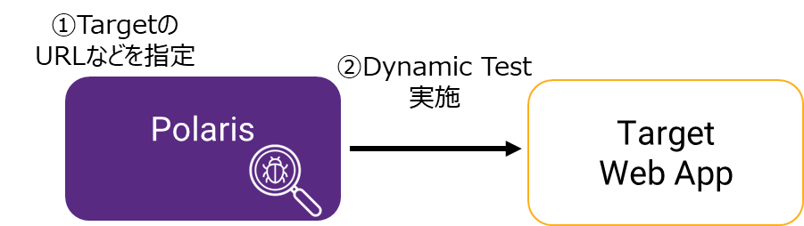
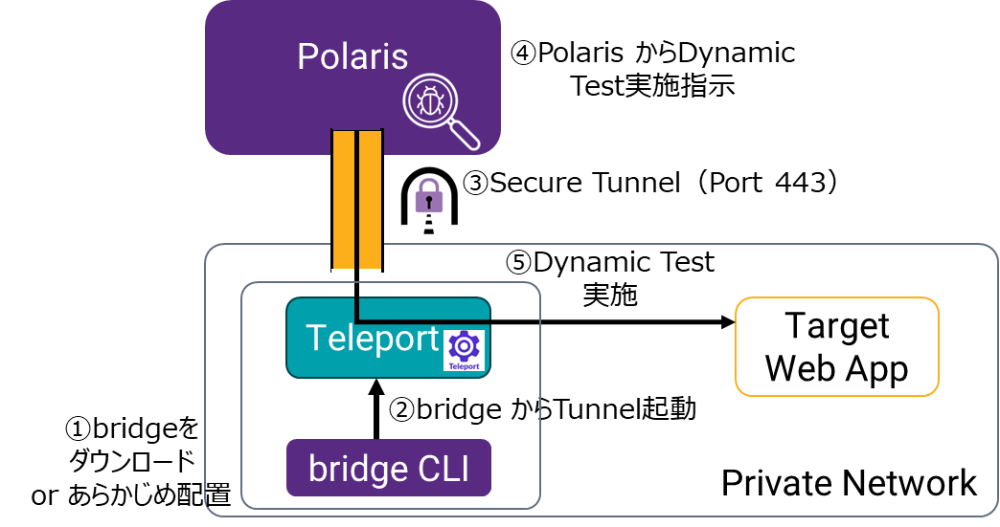
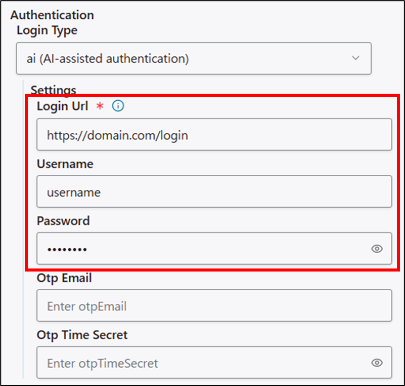
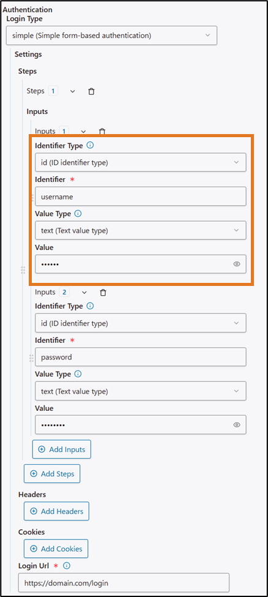
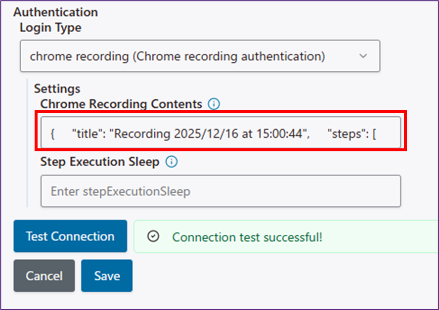
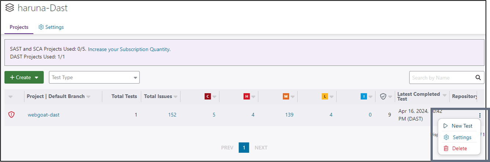
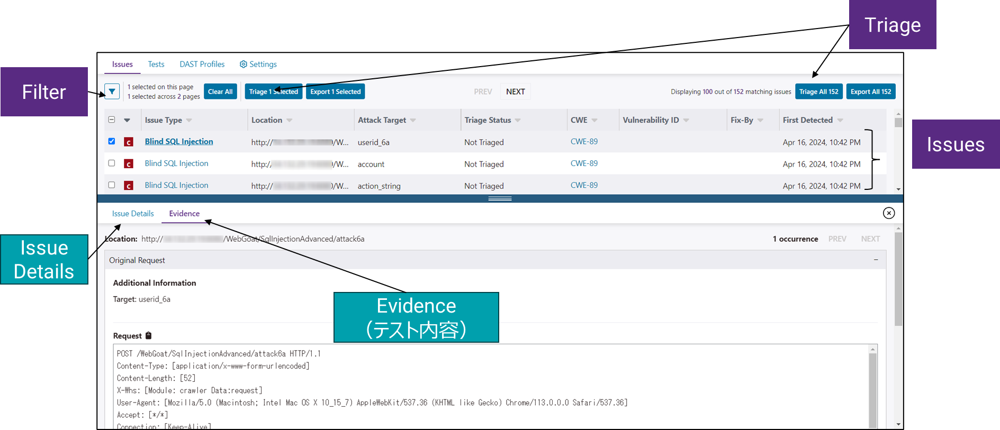
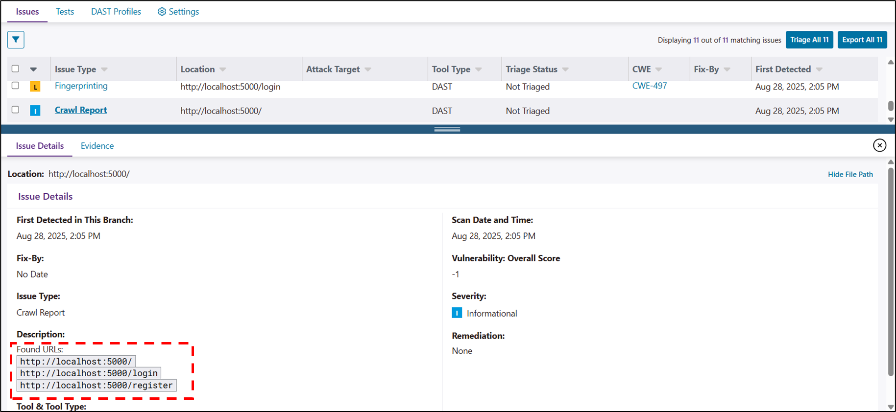
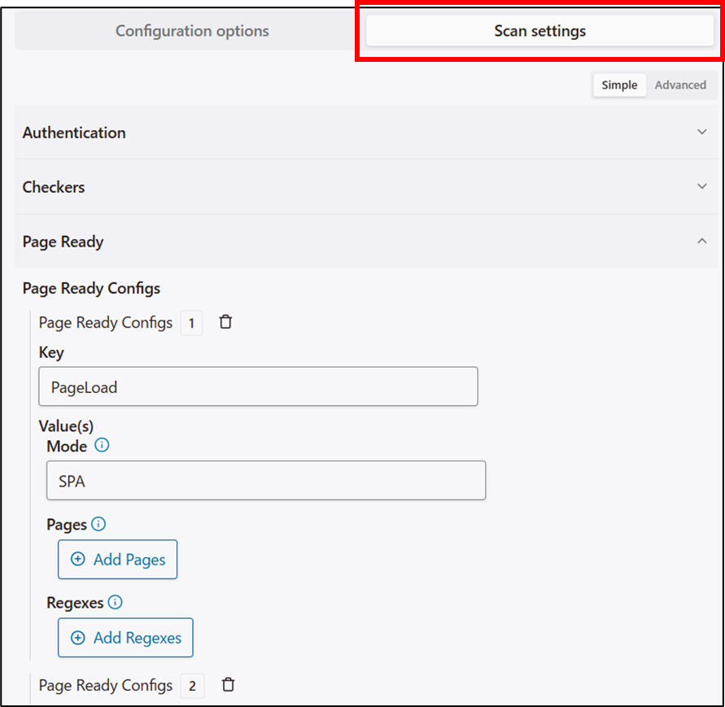
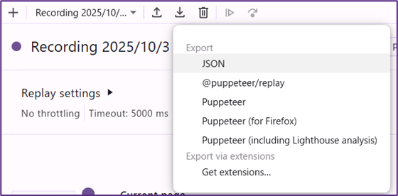

# PoVガイド DAST編

## 本資料について

本資料は、Polaris の PoC 手順のうち、DAST 機能（fAST Dynamic）固有の手順について記載するものです。
PoC で共通する注意事項や、SAST/SCA 機能と共通する要素については、記載してありません。Polaris PoCガイド（メイン資料）を先に参照してください。

ドキュメント：[Test web applications and APIs with Polaris fAST Dynamic](https://documentation.blackduck.com/bundle/polaris-docs/page/polaris/documentation/t_dast-polaris.html) も参考にしてください。

## PoV作業の流れ

1. アカウント作成（SAST/SCAと共通）
2. DAST初期設定
3. DAST解析
4. 結果の閲覧（SAST/SCAと一部共通）

## 構成確認

テスト対象のアプリケーションが、Polaris からアクセス可能かどうかで構成が変化します。

### Polaris（クラウド）からアクセス可能な場合

Polaris はテスト対象のアプリケーションに直接アクセスします。

PolarisのIPアドレスは以下のレンジです (参考: [Polaris IP ranges](https://documentation.blackduck.com/bundle/polaris-docs/page/polaris/documentation/t_ip-ranges.html))

- 192.231.134.0/24



### テスト対象がプライベートネットワークにある場合

テスト対象がプライベートネットワークにある場合、テスト実施中は Secure Tunnel の起動が必要です。
※Secure Tunnel (Teleport) の動作環境は **MacまたはLinuxのみ** サポートします。



## DAST初期設定

### アプリケーションとプロジェクトの作成

Application と Project は解析結果を管理する単位です。解析前にそれぞれを作成します。

### Applicationの作成

1. Applicationの作成Portfolioの「+Create」 >「New Application」 をクリック
2. Application Detailsを設定
    - Application Name： 任意の名前（検証対象のソフトウェア名など）
    - Subscriptions：
        - 「SAST/SCA/DAST Subscription」：それぞれPoC用のSubscriptionを選択
        - DASTの解析を行うためには、DAST Subscription を割り当てください。

> [!Warning]
> 標準的なPoCでは Application・DAST Project は1つのみ作成可能です。
> Application の作成時点で Subscription を消費するため、作成済みApplicationを削除しないでください。追加申請が必要になります。

### DAST Project と Profile の作成

1. SAST/SCA と同様に、 Application の「+Create」＞ 「New Project」をクリック
2. Project 作成画面で、以下を入力
    - Project Type：DAST
    - Project Name：任意の名前
    - Entry Point URL：テストターゲットのURL
        - Internal の場合は「～ in a private network」にチェックを入れた上で、Secure Tunnelから見た内部のアドレスを入力
    - Target Type: Web Application または API を選択
3. Project の作成画面でDAST Profile を設定
    - Profile Name：任意の名前
    - Perform Active Attacks：チェックを入れるとより侵入的なテストを有効にします
        - 本番環境での使用は意図されていません
    - Allowed Hosts :  一時的にEntry Pointと違うドメインに遷移する場合にURLを入力
        - 例）
            - Entry Point URL： `https://example.com/`
            - Allowed Hosts ：`https://securelogin.example.com/`
        - Authentication Login Type： [Authentication](#Authentication) を参照
4. 【スキップ可能】設定入力が終わったら、「Test Connection」を実施
    1. 【Private Networkのみ実施】 Secure Tunnel を起動 詳細：
    2. 「Test Connection」をクリック してテスト接続
        - Connection successful が表示されたら テスト接続は成功です。
        - 失敗した場合は、失敗時のログやスクリーンショットを表示するリンクが表示されます。
5. 「Save」で Project と Profile を保存

> [!NOTE]
> 保存後にDAST Profile を編集する場合は、DAST Project 内の「DAST Profiles」タブから編集します

#### Authentication

Polarisが対象のアプリケーションにログインしてテストするための認証情報を Profileの Authenticationの項目で設定します。
詳細：[Create DAST projects for web applications and APIs](https://documentation.blackduck.com/bundle/polaris-docs/page/polaris/documentation/t_create-dast-project.html)

2026/3/31現在、Login Type として以下が用意されています。

- **none** ・・・ログイン不要
- **[ai](#ai)** :・・・AIによるスマートなログイン（推奨）
- **[simple](#simple)**・・・ユーザー名とパスワードなどを指定のテキストボックスに入力するシンプルな方式
- **SAML** : ログインにSAMLが選択されいる場合に選択。基本はSimpleと同様のインプットが必要。
- **selenium** : Selenium で記録した手順（.side ファイル）でログイン
- **[chrome-recording](#chrome-recording)** : Chrome Recording で記録した手順（.jsonファイル）でログイン
- **header** ・・・ ヘッダーによる認証
- **basicAuth** ・・・ Basic認証

##### ai

**URL・ユーザー名・パスワード** を入力すると、Polaris の AI アシストにより画面を自動認識し最適なログインを行います。

ワンタイムパスワードを使う場合はOTPのメールアドレスとシークレットを追加で入力することも可能です。



##### simple

フィールドの「どこ」に「何」を入力するかの手順（Steps）を細かく設定して、ログイン処理をPolarisに指定します

- Steps・・・手順。画面が複数にわたる場合は２つ以上を設定。
- Inputs・・・入力する値を設定
    - Identifier Type： Name, id, xpath, CSS から選択し、フィールドを探すキーの種類を指定
    - Identifier： Identifier Typeに応じた識別子を入力
    - Value Type：text, totp から指定（基本はtext）
    - Value： 入力する値



##### chrome-recording

Chrome の Recording 機能でレコーディングを用いてログインします。
Chrome RecordingからエクスポートしたJSONファイルの中身をコピー＆ペーストして、 Polarisにログイン手順を指示します。



## 解析

Project の右側のメニューから「New Test」をクリックして DASTのTestを開始します。
Private Network のテスト対象の場合は、起動前に [SecureTunnel](#SecureTunnel) を実施してください。
Polaris から 対象のWebアプリケーションへのテストが開始されます。



### SecureTunnel

Private Network 内のサイトの DAST テストをする場合は、下記手順で Secure Tunnel を起動した状態にしていてください。

1. Bridge CLIをダウンロード
2. 以下のコマンドで、Bridge CLIを用いて Tunnel を起動
    - Error 表示がなく、「The new service has started successfully.」のメッセージが表示されることを確認

コマンド：Secure Tunnelの起動

```bash
export BRIDGE_POLARIS_ACCESSTOKEN=<POLARIS_ACCESSTOKEN>
bridge-cli --stage polaris-secure-tunnel \
    polaris.application.name=アプリケーション名 \
    polaris.project.name=プロジェクト名 \
    polaris.serverUrl="https://poc.polaris.blackduck.com"
```

詳細：[Connect to an internal DAST target from the Bridge CLI](https://documentation.blackduck.com/ja-JP/bundle/bridge/page/documentation/t_polaris_teleport.html)

## 結果確認

### 代表的な解析方法の結果

SAST/SCA と同様にProject の Issues タブから結果を確認します。



「Info」（青い i アイコン）レベルのIssues では、DAST テストのクローリング結果などのテスト実施レポートを確認することが可能です。

テスト実施後はテストのクローリング結果を確認してください。



## Appendix

### Web API のプロファイル作成

Polaris では Web API のDAST テストを実施可能です。
Web アプリケーション用とは別にDAST Project が必要になります。両方実施する場合は 2 つの Project 必要が必要になります。
実施には、API の定義情報が必要があります。

DAST Profile の設定項目の中で、API固有の設定は以下となります。

- Authentication: none または headerを選択
        - Headers の場合、テスト対象の認証のために必要なキーなどを入力
- API Specification Type: APIの定義ファイルをアップロードまたはURLを入力
    - サポートする形式
        - OpenAPI / Swagger Specification  (.yml, . yaml, .json)
        - Postman Collection (.json)
        - HTTP Archive file (.har)
        - GraphQL SDL (.sdl)
        - GraphQL Introspection URL

### Scan Settings

DAST Profile 設定画面の「Scan Settings」タブでは、より細かい DAST Profile 設定を提供しています。  
※PoV では担当SEと相談しながら、必要に応じての利用を推奨します



Scan Settings は JSON形式で、「Download Scan Settings」から保存、「Load Scan Settings File」から再読み込みをすることが可能です。

詳細ドキュメント

- [DAST scan settings](https://documentation.blackduck.com/bundle/polaris-docs/page/polaris/documentation/r_dast-scan-settings.html)
- [Configure JSON scan settings and authentication profiles](https://documentation.blackduck.com/bundle/polaris-docs/page/polaris/documentation/t_dast-advanced.html)

### CLI からの DAST テスト起動

Bridge CLI を使用して、CLI からDAST テストを起動することも可能です。
GUIからの起動の方がエラーログが見やすいため、初期設定が終わった後の継続的なテストにご利用ください。
CLI から起動すると、Internal のテスト対象をテストする場合、Secure Tunnel も自動的に実行します。

Polaris オプション例：CLIからのDAST起動

```json
{
  "data": {
    "polaris": {
      "application": { "name": "アプリケーション名" },
      "project": { "name": "プロジェクト名" },
      "assessment": {
        "types": ["DAST"]
      },
      "serverUrl": "https://poc.polaris.blackduck.com/"
    }
  }
}
```

コマンド例：

```bash
bridge-cli --stage polaris --input input.json
```

### Chrome Recording ファイルの作成例

2025/12/16 時点の参考手順

1. 起動：Chrome の開発者ツールの「Recorder」タブを開く
2. レコーディング：「Create recording」 をクリック
    - 「RECORDING NAME」に任意の名前を入力
    - 「Start recording」ボタンをクリック
    - （レコーディングが始まり、操作手順が記録される）
    - 「End Recording」をクリック
3. 編集と動作確認
    - レコーディング後の各行（Step）をクリックして操作内容を確認。ログイン処理に不要なステップがあれば削除。
    - 「Replay」ボタンから、ログイン処理ができるか確認。
4. エクスポート
    - Export（下矢印アイコン） からJSON形式でエクスポート


