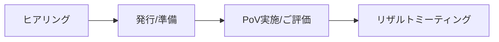

# PoVガイド実践編

## PoVの流れ

- ヒアリング
  - PoVの目的・目標と解析対象（言語、規模、ビルドコマンド等）を確認します。
  - ヒアリング結果をもとに実施可否を判断します。
- 発行・準備
  - 評価ユーザーのメールアドレスを担当SEに連絡してください。
  - お客様は解析対象のソース一式または解析対象のWebアプリを準備します。
  - Black DuckがPoV用のPolaris環境を用意し、ログイン情報を送付します。
- 解析・評価
  - お客様がソースをPolarisへアップロードして解析結果を確認します。
  - 必要に応じてBlack DuckのSEがサポートします。
- リザルトミーティング
  - 結果報告会（最大1時間）でPoVの目的達成を確認します。



- ヒアリング
  - PoV の目的・目標および解析対象（言語、規模、ビルドコマンド等）を確認します。
  - ヒアリング結果をもとに PoV の実施可否を判断し、次のステップに進みます。
- 発行・準備
  - Polaris を評価するユーザーのメールアドレス一覧を担当 SE に連絡してください。
  - お客様は解析対象のソースコード一式または解析対象の Web アプリケーションを準備してください。
  - ブラックダックが PoV 用 Polaris 環境を用意し、各ユーザーにログイン情報をメールで送付します。
- 解析・ご評価
  - お客様はソースコードを Polaris にアップロードし、解析結果を確認してください。
  - 必要に応じてブラックダックの SE がメールや画面共有でサポートします。

> [!Note]
> PoV期間は2週間です。

## ダウンロード・インストール・初期設定

### Polaris アカウントの初期設定

Polaris の PoVでは、事前にお客様からいただいたメールアドレスを基に、Black Duck Software のSEがPolaris PoV環境へのアカウント登録を行います。

> [!Note]
> 設定には、二段階認証のアプリケーション （FreeOTP または Google Authenticator）が必要です。

1. `noreply@blackduck.com` からの案内メールに従いアカウント初期設定画面を開く
2. Polaris のログインパスワードを設定
3. Google Authenticator または FreeOTP でQRコードを登録
4. 表示された One-time code と Device Name を入力

> [!Warning]
> 自動配信メールのURL（有効期限12時間）が切れた場合は、下記で再発行してください。
>
> 1. Polaris ([https://poc.polaris.blackduck.com](https://poc.polaris.blackduck.com/)) にアクセス
> 2. 登録メールアドレスを入力
> 3. 「Forgot Password ?」からパスワードリセットメールを再送

設定したアカウントで、PoV環境にログインします。

- URL：[https://poc.polaris.blackduck.com/](https://poc.polaris.blackduck.com/)

ここで画面の説明をしたい #TODO-IMAGE

### アプリケーションとプロジェクトの作成

Application と Project は解析結果を管理する単位です。解析前にそれぞれを作成します。

> [!warning]
> 標準的なPoVではApplicationは1つのみ作成可能です。
> Application の作成時点で Subscription を消費するため、**作成済み  Applicationを削除しないでください**。追加申請が必要になります。

1. Application の作成
     1. Portfolioの「+Create」 - 「New Application」 をクリック
     2. Application Detailsを設定
       - Application Name： 任意の名前（検証対象のソフトウェア名など）
       - Subscriptions: PoV用の SAST/SCA/DAST Subscriptionをそれぞれ選択
         - PoV の対象機能に応じて、設定すべきSubscriptions 内容は変化します
2. SAST/SCA Project の作成
     1. 作成した Application の 「+Create」 - 「New Project」をクリック
     2. プロジェクト作成画面で設定
       - Project Type : 「SAST&SCA」 を指定
       - Project Name:  任意の名称を指定 （アプリケーション名やリポジトリ名、コンポーネント名 等）

> [!NOTE]
> PoV において Applicationと Project数の上限に注意してください。
>
> - Application：最大1個
> - SAST&SCA Project：最大5個
> - DAST Project：最大1個

## 解析

Polaris の SAST/SCA 解析は、下記の3種類のいずれかを選択して実施します。

1. コードアップロード
2. SCM
3. CLI

### ①コードアップロードによるSAST/SCA解析

1. 作成したプロジェクト一覧のメニューから「New Test」をクリック #TODO-IMAGE メニュー位置がわかりにくい
2. New Test 画面に解析対象のソースコード一式をzip圧縮したファイルをアップロード
3. 「Begin Test」をクリック
4. Test の終了を待つ

### ②SCM Integration による SAST/SCA解析

ここでは、SCM Integration のうちGitHub を使用する場合の例で説明します。

GitHub などの SCM ホスティングサービスで下記の情報を用意します。

- リポジトリのURL
- リポジトリにアクセスできる権限のあるトークン
  - GitHub の場合、トークン作成時に「repo」へのアクセスを付与してください

Polaris 上で、SCM Integration を設定します。

1. プロジェクトの「Settings」 - 「Integrations」 を開く
2. Integration 画面でリポジトリの情報を入力
   - Select the source of repository: リポジトリの種類を入力
   - Repository URL: リポジトリのURL
   - Repository Access Token: アクセストークン
3. 「Test your connection」  をクリック
4. 「Save」 をクリック
5. 自動的にTest(解析)が始まるため、Test 終了を待つ

> [!Note]
> main ブランチ以外を解析する
> デフォルトではPolaris は リポジトリのメインブランチ（main や master など) からソースコードを取得します。
> それ以外のブランチを解析する場合は、Polaris 上で 「Branch」 を作成してから解析します。
>
> 1. プロジェクトの「Branches」 - 「Create New Branch」をクリック
> 2. SCMに存在するブランチを選択して「Add」をクリック

### その他のSCM

GitLab, Azure DevOps など その他の SCM と連携する場合は、下記のドキュメントを参考にしてください。
[Integrate a SCM Repository to a Project](https://poc.polaris.blackduck.com/developer/default/polaris-documentation/t_how-to-integrate-repository)

### ③Bridge CLI による SAST/SCA 解析

#### 前提

Bridge CLI というCLIツールを用いてCLIで解析を行う方法を説明します。
この解析を実行する環境は、お客様自身でご用意ください。
詳細は、[Using Bridge CLI with Polaris](https://documentation.blackduck.com/ja-JP/bundle/bridge/page/documentation/c_using-bridge-with-polaris.html) をご覧ください。

ユースケース例

- 解析をお客様のCIパイプラインに組み込む場合
- コードアップロードまたはSCMでサポートされていない言語 または パッケージマネージャー を使いたい場合
- SAST 解析オプションを指定する場合
- SCA シグネチャスキャンを実施する場合

環境に必要なもの

- SASTの場合：ソースコードビルド環境（スキャンにビルドが必要な言語の場合）
- SCAの場合：パッケージマネージャーの動作環境

#### Bridge CLI とアクセストークンの準備

Bridge CLI のダウンロードと、Bridge CLIがPolarisにアクセスするためのアクセストークンを準備します。

1. アクセストークンを準備する
    1. Polaris の 「＜ユーザーアカウント名＞」 - 「Account」 を選択
    2. 「Access Tokens」の「＋Create New Token」  をクリック
    3. Create New Token 画面で 任意の「Token Name」を入力  
        - 例： CI環境名やプロジェクト名などを推奨
    4. 「Save」をクリック
    5. 生成されたTokenを保存
2. Bridge CLIを準備する
    1. Polaris の 「＜ユーザーアカウント名＞」 - 「Account」 を選択
    2. 「Downloads」 からOSに対応したダウンロードパッケージをクリックしてファイルをダウンロード
    3. パッケージを解析環境の任意の場所に展開

#### Bridge の設定ファイルの作成

解析環境（ソースコードがある場所）で Bridgeの設定ファイル（JSON形式）を作成してください

```json title=polaris_config.json
{
    "data": {
        "polaris": {
            "application": {
                "name": "アプリケーション名"
            },
            "project": {
                "name": "プロジェクト名"
            },
            "branch": {
                "name": "main"
            },
            "assessment": {
                "types":  ["SAST", "SCA"]
            },
            "serverUrl": "https://poc.polaris.blackduck.com"
        }
    }
}
```

##### 【オプション】SASTのビルドキャプチャ

SASTのビルドキャプチャ必要な言語が解析対象の場合、ビルドコマンドを指定するために、ソースコードディレクトリの root に coverity.yamlファイルを作成してください。
詳細は、[Configuring Coverity Thin Client for use with Bridge CLI and Polaris](https://poc.polaris.blackduck.com/developer/default/documentation/t_cov-thin-client) も参照してください。

ファイル例（Java, Mavenの場合）

```yaml title=coverity.yaml
capture:
    build:
        clean-command: mvn clean
        build-command: mvn install
```

coverity.yaml ファイル例（独自スクリプトの場合）

```yaml title=coverity.yaml
capture:
    build:
        clean-command: clean.sh
        build-command: build-it.sh
```

##### 【オプション】SCAのシグネチャスキャン

SCA のシグネチャスキャンを実施する場合には、Bridge の設定ファイルの  ```polaris.test.sca.type```  に ```SCA-PACKAGE, SCA-SIGNATURE``` を記載します。  追加しない場合はパッケージスキャン（```SCA-PACKAGE``` のみを記載した状態）とみなされます。

シグネチャスキャンを設定する例

```json file=polaris_config.json
{
    "data": {
        "polaris": {
            "application" : { "name": アプリケーション名 },
            "project" : { "name": プロジェクト名 },
            "branch" : { "name": "main" },
            "assessment" : {
                "types" :  ["SCA"]
            },
            "test" : {
                "sca" : {
                    "type" : "SCA-PACKAGE, SCA-SIGNATURE"
                }
            },
            "serverUrl" : "https://poc.polaris.blackduck.com/"
        }
    }
}
```

#### Bridge による解析の実行

1. 解析対象のソースコードのルートディレクトリに移動
2. 環境変数 ```BRIDGE_POLARIS_ACCESSTOKEN``` にPolaris のアクセストークンを設定
3. Bridge CLI のコマンドを実行

コマンド例

```sh
export BRIDGE_POLARIS_ACCESSTOKEN=<POLARIS_ACCESSTOKEN>
bridge-cli --stage polaris --input <JSONファイル>
```

Windows の例（PowerShell）

```powershell
$env:BRIDGE_POLARIS_ACCESSTOKEN = '<POLARIS_ACCESSTOKEN>'
bridge-cli --stage polaris --input <JSONファイル>
```

Windows の例（CMD）

```bat
set BRIDGE_POLARIS_ACCESSTOKEN=<POLARIS_ACCESSTOKEN>
bridge-cli --stage polaris --input <JSONファイル>
```

> [!Note]
> JSON ファイルを作成せずに、同等の内容をコマンドラインで全て指定することも可能です。
>
> ```sh
> bridge-cli --stage polaris polaris.application.name="アプリケーション名"  polaris.project.name="プロジェクト名" polaris.branch.name="<BRANCH_NAME>" polaris.serverUrl="https://poc.polaris.blackduck.com/" polaris.assessment.types="SAST,SCA"
> ```

## お客様固有の開発環境がある場合

### SASTで組み込みコンパイラを指定する場合

C言語の組み込み向けコンパイラなど、コンパイラの名称やアーキテクチャが特殊な場合、コンパイラの種類を指定する必要があります。PoV において、組み込みコンパイラを用いるアプリケーションの解析を希望する場合は、事前に担当SEにご相談ください。

例： cov-configure の設定

```yaml
capture:
  build: 
    clean-command: "make clean"
    build-command: "make -j 10"
compiler-configuration:
  cov-configure: 
  - [ --template, --compiler, arm-linux-gnueabi-gcc, --comptype, gcc ]
  - [ --template, --compiler, arm-linux-gnueabi-g+, --comptype, g+ ]
```

上記の例では、```compiler-configuration.cov-configure``` の下に、リストとして組み込みコンパイラの設定を記載しています。配列の3番目（```arm-linux-gnueabi-gcc``` など）には、コンパイラの実行ファイル名が入ります。配列の5番目（```gcc``` など）には、コンパイラの種類が入ります。
comptype の公式の調べ方は？ #TODO

詳細: [Configuring Coverity Thin Client for use with Bridge CLI and Polaris](https://poc.polaris.blackduck.com/developer/default/documentation/t_cov-thin-client)

参考:[コンパイラを設定する Coverity Analysis](https://documentation.blackduck.com/ja-JP/bundle/coverity-docs/page/coverity-analysis/topics/configuring_compilers_for_coverity_analysis.html)

### SCAのパッケージマネージャー解析をCLIで実施する場合

SCAの解析で、サポートする一部のパッケージマネージャーは、Bridge CLIでのみの解析をサポートしていたり、Bridge CLI を用いた方が解析精度が良くなる場合があります。

使用しているパッケージマネージャー [Polaris Support Information](https://poc.polaris.blackduck.com/developer/default/polaris-documentation/r_support-matrix)のページの 「Table 8. SCA Language and Package Manager Support」 を参照して

例1: Test mode All をサポートする場合

| Package manager | Language    | Test mode | Supported | Entry point | Supported detectors, requirements   | Accuracy |
| --------------- | ----------- | --------- | --------- | ----------- | ----------------------------------- | -------- |
| CocoaPods       | Objective-C | All       | Supported | Pod Lock    | Pod Lock<br><br>Files: Podfile.lock | High     |

パッケージマネージャーの 「CocoaPods」 を使用している場合、「Podfile.lock」ファイルが存在すれば、全て（コードアップロード、SCM連携、Bridge CLI）の解析方法をサポートします。この場合はあまり問題になりません。

例2：Bridge CLI のみをサポートしている場合

| Package manager | Language  | Test mode                      | Supported     | Entry point | Supported detectors, requirements                                                            | Accuracy |
| --------------- | --------- | ------------------------------ | ------------- | ----------- | -------------------------------------------------------------------------------------------- | -------- |
| BitBake         | _Various_ | Code upload or SCM integration | Not Supported |             |                                                                                              |          |
|                 |           | Bridge CLI (CI/CLI)            | Supported     | Bitbake CLI | Bitbake CLI<br><br>Properties: Package names<br>Files: build env script<br>Executables: bash | High     |

「Code Upload or SCM integration」が「Not Supported」となっているため、解析をするには Bridge CLI が必須となります。
また、解析に必要なもの（requirements）なものとして、下記の３つが挙げられています。

- Properties: Package names：Package nameがプロパティに入っていること
- Files: build env script
- Executables: bash

「Properties に指定の内容が含まれていること」、「指定のファイルが存在すること」、「bash が実行可能なこと」とあるため、解析環境でこれらの条件を満たしているか事前に確認してください。

例3: 全ての解析方法をサポートするが条件が異なる場合

| Package manager | Language  | Test mode                      | Supported | Entry point             | Supported detectors, requirements                                      | Accuracy |
| --------------- | --------- | ------------------------------ | --------- | ----------------------- | ---------------------------------------------------------------------- | -------- |
| Maven           | _Various_ | Code upload or SCM integration | Supported | Maven Project Inspector | Maven Project Inspector<br><br>Files: pom.xml                          | Low      |
|                 |           | Bridge CLI (CI/CLI)            | Supported | Maven CLI               | Maven CLI<br><br>Files: pom.xml<br>Executables: mvnw or mvn            | High     |
|                 |           |                                |           |                         | Maven Project Inspector<br><br>Files: pom.xml                          | Low      |
|                 |           |                                |           | Maven Wrapper CLI       | Maven Wrapper CLI<br><br>Files: pom.groovy<br>Executables: mvnw or mvn | High     |
|                 |           |                                |           |                         | Maven Project Inspector<br><br>Files: pom.xml                          | Low      |

この Maven の例の場合は、コードアップロードとSCM連携による解析が可能ですが、「Accuracy（精度）」が「Low」のため、CLI を用いて解析する方がより正確な結果が得られることが期待されます。
「pom.xml」ファイルが存在することに加えて、「mvn」コマンドが解析環境で実行可能である必要があります。

## 結果確認

### 代表的な解析方法の結果

解析が終了するとプロジェクトの 「Issues」タブ結果を見ることができます。

画面説明をしたい #TODO-IMAGE

Issues 画面の 左側で、表示されるIssuesのフィルターが可能です。
チェックボックスに

- 必要に応じて下記の内容を入れるようにしてください
  - メインのIssues画面へのナビゲーション
  - Issueのフィルターの使い方
  - Issue １件の見方
  - トリアージのしかた
  - 製品固有のビュー

## リザルトミーティング

リザルトミーティングの説明と、リザルトミーティングに用意してほしいもの #TODO

## オプション機能の紹介

お客様に時間があれば見てほしい機能と、ドキュメントの位置を提示します。

### Reporting

Reportingでは指定したアプリケーションのPDFレポートまたはSBOMを出力可能です。

生成が終わったレポートは、ダウンロードアイコンからダウンロードしてください。

詳細：[The Reporting page](https://poc.polaris.blackduck.com/developer/default/polaris-documentation/c_polaris-ui-reports)

### Dashboards

Dashboardsでは、画面右のFiltersで指定された範囲のアプリケーションおよびプロジェクトのデータを表示します。

詳細： [The Dashboards page](https://poc.polaris.blackduck.com/developer/default/polaris-documentation/c_polaris-ui-dashboard)

### CIツール

Bridge CLI を用いると、殆どの環境でPolarisの自動解析環境を構築することが可能となります。

GitHub, GitLab, Azure DevOps, Jenkins などには、自動解析ををサポートするプラグインやテンプレートをご用意しています。下記の資料を参考にしてください。

- Bridge CLI について
  - [Bridge CLI Documentation - Overview](https://documentation.blackduck.com/ja-JP/bundle/bridge/page/documentation/c_overview.html)
- CIツールとの連携方法ドキュメント
  - GitHub: [Using Black Duck Security Scan Action for Polaris](https://documentation.blackduck.com/ja-JP/bundle/bridge/page/documentation/c_github-polaris.html)
  - GitLab: [Using the Black Duck Security Scan Template with Polaris](https://documentation.blackduck.com/ja-JP/bundle/bridge/page/documentation/c_gitlab-with-polaris.html)
  - Azure DevOps: [Using Black Duck Security Scan Extension with Polaris](https://documentation.blackduck.com/ja-JP/bundle/bridge/page/documentation/c_azure-with-polaris.html)
  - Jenkins: [Jenkins - Black Duck Security Scan Plugin for Jenkins](https://documentation.blackduck.com/ja-JP/bundle/bridge/page/documentation/c_using-jenkins-plugin.html)

### Code Sight

Code Sight は IDE連携のプラグインです。Code Sight を用いるとPolaris の結果の閲覧やローカル解析をIDEから行うことが可能になり、問題の修正サイクルの効率化に繋がります。
詳細：[Connect Code Sight to Polaris](https://poc.polaris.blackduck.com/developer/default/polaris-documentation/t_code-sight)

#### Code Sight サポートIDE（2024/12現在）

- Visual Studio Code
- IntelliJ
- Visual Studio

#### Code Sight の利用方法

詳細：[Viewing Polaris issues on the server](https://documentation.blackduck.com/ja-JP/bundle/codesight_latest/page/topics/polaris/r_code_sight_polaris.html)

1. IDE の Marketplace で Code Sightをインストール
2. Code Sight メニューを表示  （VS Codeの場合、左側のアヒルアイコンをクリック）
3. Status - Products and Licenses で Polaris と接続
4. Local View または Team View の Configuration（歯車マーク）で各種設定

> [!Warning]
> 「S」アイコンのプラグインは旧版です。アヒルのアイコンのものをご利用ください。
